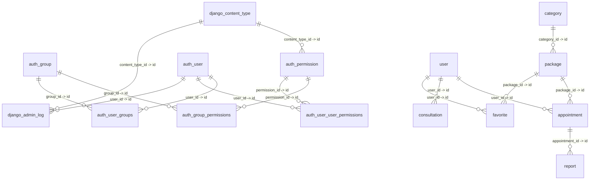

# 数据库结构与 ER 关系（自动导出）

- 导出时间：`2026-04-09 21:52:06`
- 数据库引擎：`django.db.backends.mysql`
- 数据库名：`fangying_db`
- 表数量：`20`
- 过滤模式：`全部表`

## ER 关系图（Mermaid）

## 表字段清单

### `admin`

| 字段 | 类型 | 可空 | 默认值 | 主键 | 外键引用 |
|---|---|---|---|---|---|
| id | bigint | 否 | auto_increment | 是 |  |
| username | varchar(50) | 否 |  | 否 |  |
| password | varchar(128) | 否 |  | 否 |  |
| name | varchar(50) | 否 |  | 否 |  |
| is_active | tinyint(1) | 否 |  | 否 |  |
| last_login | datetime(6) | 是 |  | 否 |  |
| created_at | datetime(6) | 否 |  | 否 |  |

### `appointment`

| 字段 | 类型 | 可空 | 默认值 | 主键 | 外键引用 |
|---|---|---|---|---|---|
| id | bigint | 否 | auto_increment | 是 |  |
| name | varchar(50) | 否 |  | 否 |  |
| phone | varchar(20) | 否 |  | 否 |  |
| id_card | varchar(18) | 否 |  | 否 |  |
| gender | smallint | 否 |  | 否 |  |
| appointment_date | date | 否 |  | 否 |  |
| time_slot | varchar(20) | 否 |  | 否 |  |
| order_no | varchar(32) | 否 |  | 否 |  |
| amount | decimal(10,2) | 否 |  | 否 |  |
| status | smallint | 否 |  | 否 |  |
| remark | varchar(200) | 否 |  | 否 |  |
| reject_reason | varchar(200) | 否 |  | 否 |  |
| created_at | datetime(6) | 否 |  | 否 |  |
| updated_at | datetime(6) | 否 |  | 否 |  |
| package_id | bigint | 是 |  | 否 | package.id |
| user_id | bigint | 否 |  | 否 | user.id |

### `article`

| 字段 | 类型 | 可空 | 默认值 | 主键 | 外键引用 |
|---|---|---|---|---|---|
| id | bigint | 否 | auto_increment | 是 |  |
| title | varchar(100) | 否 |  | 否 |  |
| content | longtext | 否 |  | 否 |  |
| cover_image | varchar(255) | 否 |  | 否 |  |
| views_count | int | 否 |  | 否 |  |
| is_active | tinyint(1) | 否 |  | 否 |  |
| created_at | datetime(6) | 否 |  | 否 |  |
| updated_at | datetime(6) | 否 |  | 否 |  |

### `auth_group`

| 字段 | 类型 | 可空 | 默认值 | 主键 | 外键引用 |
|---|---|---|---|---|---|
| id | int | 否 | auto_increment | 是 |  |
| name | varchar(150) | 否 |  | 否 |  |

### `auth_group_permissions`

| 字段 | 类型 | 可空 | 默认值 | 主键 | 外键引用 |
|---|---|---|---|---|---|
| id | bigint | 否 | auto_increment | 是 |  |
| group_id | int | 否 |  | 否 | auth_group.id |
| permission_id | int | 否 |  | 否 | auth_permission.id |

### `auth_permission`

| 字段 | 类型 | 可空 | 默认值 | 主键 | 外键引用 |
|---|---|---|---|---|---|
| id | int | 否 | auto_increment | 是 |  |
| name | varchar(255) | 否 |  | 否 |  |
| content_type_id | int | 否 |  | 否 | django_content_type.id |
| codename | varchar(100) | 否 |  | 否 |  |

### `auth_user`

| 字段 | 类型 | 可空 | 默认值 | 主键 | 外键引用 |
|---|---|---|---|---|---|
| id | int | 否 | auto_increment | 是 |  |
| password | varchar(128) | 否 |  | 否 |  |
| last_login | datetime(6) | 是 |  | 否 |  |
| is_superuser | tinyint(1) | 否 |  | 否 |  |
| username | varchar(150) | 否 |  | 否 |  |
| first_name | varchar(150) | 否 |  | 否 |  |
| last_name | varchar(150) | 否 |  | 否 |  |
| email | varchar(254) | 否 |  | 否 |  |
| is_staff | tinyint(1) | 否 |  | 否 |  |
| is_active | tinyint(1) | 否 |  | 否 |  |
| date_joined | datetime(6) | 否 |  | 否 |  |

### `auth_user_groups`

| 字段 | 类型 | 可空 | 默认值 | 主键 | 外键引用 |
|---|---|---|---|---|---|
| id | bigint | 否 | auto_increment | 是 |  |
| user_id | int | 否 |  | 否 | auth_user.id |
| group_id | int | 否 |  | 否 | auth_group.id |

### `auth_user_user_permissions`

| 字段 | 类型 | 可空 | 默认值 | 主键 | 外键引用 |
|---|---|---|---|---|---|
| id | bigint | 否 | auto_increment | 是 |  |
| user_id | int | 否 |  | 否 | auth_user.id |
| permission_id | int | 否 |  | 否 | auth_permission.id |

### `banner`

| 字段 | 类型 | 可空 | 默认值 | 主键 | 外键引用 |
|---|---|---|---|---|---|
| id | bigint | 否 | auto_increment | 是 |  |
| title | varchar(50) | 否 |  | 否 |  |
| image | varchar(255) | 否 |  | 否 |  |
| link | varchar(255) | 否 |  | 否 |  |
| sort_order | int | 否 |  | 否 |  |
| is_active | tinyint(1) | 否 |  | 否 |  |
| created_at | datetime(6) | 否 |  | 否 |  |

### `category`

| 字段 | 类型 | 可空 | 默认值 | 主键 | 外键引用 |
|---|---|---|---|---|---|
| id | bigint | 否 | auto_increment | 是 |  |
| name | varchar(50) | 否 |  | 否 |  |
| description | varchar(200) | 否 |  | 否 |  |
| icon | varchar(100) | 否 |  | 否 |  |
| sort_order | int | 否 |  | 否 |  |
| is_active | tinyint(1) | 否 |  | 否 |  |
| created_at | datetime(6) | 否 |  | 否 |  |

### `consultation`

| 字段 | 类型 | 可空 | 默认值 | 主键 | 外键引用 |
|---|---|---|---|---|---|
| id | bigint | 否 | auto_increment | 是 |  |
| content | longtext | 否 |  | 否 |  |
| reply | longtext | 否 |  | 否 |  |
| status | smallint | 否 |  | 否 |  |
| created_at | datetime(6) | 否 |  | 否 |  |
| replied_at | datetime(6) | 是 |  | 否 |  |
| user_id | bigint | 否 |  | 否 | user.id |

### `django_admin_log`

| 字段 | 类型 | 可空 | 默认值 | 主键 | 外键引用 |
|---|---|---|---|---|---|
| id | int | 否 | auto_increment | 是 |  |
| action_time | datetime(6) | 否 |  | 否 |  |
| object_id | longtext | 是 |  | 否 |  |
| object_repr | varchar(200) | 否 |  | 否 |  |
| action_flag | smallint unsigned | 否 |  | 否 |  |
| change_message | longtext | 否 |  | 否 |  |
| content_type_id | int | 是 |  | 否 | django_content_type.id |
| user_id | int | 否 |  | 否 | auth_user.id |

### `django_content_type`

| 字段 | 类型 | 可空 | 默认值 | 主键 | 外键引用 |
|---|---|---|---|---|---|
| id | int | 否 | auto_increment | 是 |  |
| app_label | varchar(100) | 否 |  | 否 |  |
| model | varchar(100) | 否 |  | 否 |  |

### `django_migrations`

| 字段 | 类型 | 可空 | 默认值 | 主键 | 外键引用 |
|---|---|---|---|---|---|
| id | bigint | 否 | auto_increment | 是 |  |
| app | varchar(255) | 否 |  | 否 |  |
| name | varchar(255) | 否 |  | 否 |  |
| applied | datetime(6) | 否 |  | 否 |  |

### `django_session`

| 字段 | 类型 | 可空 | 默认值 | 主键 | 外键引用 |
|---|---|---|---|---|---|
| session_key | varchar(40) | 否 |  | 是 |  |
| session_data | longtext | 否 |  | 否 |  |
| expire_date | datetime(6) | 否 |  | 否 |  |

### `favorite`

| 字段 | 类型 | 可空 | 默认值 | 主键 | 外键引用 |
|---|---|---|---|---|---|
| id | bigint | 否 | auto_increment | 是 |  |
| created_at | datetime(6) | 否 |  | 否 |  |
| package_id | bigint | 否 |  | 否 | package.id |
| user_id | bigint | 否 |  | 否 | user.id |

### `package`

| 字段 | 类型 | 可空 | 默认值 | 主键 | 外键引用 |
|---|---|---|---|---|---|
| id | bigint | 否 | auto_increment | 是 |  |
| name | varchar(100) | 否 |  | 否 |  |
| description | longtext | 否 |  | 否 |  |
| price | decimal(10,2) | 否 |  | 否 |  |
| original_price | decimal(10,2) | 是 |  | 否 |  |
| image | varchar(255) | 否 |  | 否 |  |
| items | longtext | 否 |  | 否 |  |
| suitable_for | varchar(200) | 否 |  | 否 |  |
| notice | longtext | 否 |  | 否 |  |
| sales_count | int | 否 |  | 否 |  |
| views_count | int | 否 |  | 否 |  |
| is_hot | tinyint(1) | 否 |  | 否 |  |
| is_active | tinyint(1) | 否 |  | 否 |  |
| created_at | datetime(6) | 否 |  | 否 |  |
| updated_at | datetime(6) | 否 |  | 否 |  |
| category_id | bigint | 是 |  | 否 | category.id |

### `report`

| 字段 | 类型 | 可空 | 默认值 | 主键 | 外键引用 |
|---|---|---|---|---|---|
| id | bigint | 否 | auto_increment | 是 |  |
| result_summary | longtext | 否 |  | 否 |  |
| file_url | varchar(255) | 否 |  | 否 |  |
| doctor | varchar(50) | 否 |  | 否 |  |
| report_date | date | 是 |  | 否 |  |
| created_at | datetime(6) | 否 |  | 否 |  |
| updated_at | datetime(6) | 否 |  | 否 |  |
| appointment_id | bigint | 否 |  | 否 | appointment.id |

### `user`

| 字段 | 类型 | 可空 | 默认值 | 主键 | 外键引用 |
|---|---|---|---|---|---|
| id | bigint | 否 | auto_increment | 是 |  |
| openid | varchar(100) | 否 |  | 否 |  |
| nickname | varchar(50) | 否 |  | 否 |  |
| avatar | varchar(200) | 否 |  | 否 |  |
| phone | varchar(20) | 否 |  | 否 |  |
| real_name | varchar(50) | 否 |  | 否 |  |
| id_card | varchar(18) | 否 |  | 否 |  |
| gender | smallint | 否 |  | 否 |  |
| is_active | tinyint(1) | 否 |  | 否 |  |
| created_at | datetime(6) | 否 |  | 否 |  |
| updated_at | datetime(6) | 否 |  | 否 |  |

