中国计量大学现代科技学院

本科毕业设计（论文）

基于MFC的网络五子棋

**Network Gobang Based on MFC**

> 学生姓名 [赵杰]{.underline} 学号 [1732332218]{.underline}

学生专业 [计算机科学与技术]{.underline} 班级 [计算机172班]{.underline}

二级学院 [信息工程学院]{.underline} 指导教师 [周永霞]{.underline}

中国计量大学现代科技学院

2026年4月

**郑 重 声 明**

本人呈交的毕业设计论文，是在导师的指导下，独立进行研究工作所取得的成果，所有数据、图片资料真实可靠。尽我所知，除文中已经注明引用的内容外，本学位论文的研究成果不包含他人享有著作权的内容。对本论文所涉及的研究工作做出贡献的其他个人和集体，均已在文中以明确的方式标明。本学位论文的知识产权归属于培养单位。

**本人承诺，论文查重率超过 30%,都视为抄袭。**

学生签名： 日期：

  -------- ---- ------- -------------- ------------- ---------- ---- -------
   分类号   ：   TP391                                 密 级     ：   公开

    UDC     ：    004                                 学校代码   ：   13292
  -------- ---- ------- -------------- ------------- ---------- ---- -------

中国计量大学现代科技学院

本科毕业设计（论文）

基于MFC的网络五子棋

**Network Gobang Based on MFC**

  ----------------- -------------- ----------- ----------------------------
  作 者             张三           学 号       Times New Roman四号

  申 请 学 位       工学学士       指导教师    李四教授

  学 科 专 业       自动化         培养单位    中国计量大学现代科技学院

  答辩委员会主席    宋体四号       评 阅 人    钱六
  ----------------- -------------- ----------- ----------------------------

2026年4月\
**致 谢**

当这篇论文撰写完成的时候，也预示着我的大学时光进入了尾声。四年的学习与经历马上就要结束，即将踏出校园迈入社会工作的我，回顾自己曾经走过的岁月时，也颇感学有所成。在大学里我学习到了丰富的理论知识，体验到了与以往不一样的生活，也在实践中收获了真知，让我倍感充实。本文的收笔，也是对我大学生活的一种见证。

在这忙碌而充实的学习过程中，自然少不了他人的相助。首先我要诚挚地感谢我的毕业设计指导教师周老师。是他在整个毕业设计过程中为我悉心指导，还要在繁忙的教学工作中抽出时间为我查阅论文，并提出修改的建议，我的论文才因此而变得越来越完善。同时也要感谢所有指点、教学过我的老师们，是他们认真负责的工作态度与严谨科学的教学风格，给了我无比珍贵的启迪，让我在学习成长的过程中一路向前。也感谢四年大学生活中陪伴在我身边的同学和朋友们，是他们在我遇到困难时给出了宝贵的建议与帮助，让我充实地度过了这四年的学习生活。

**基于MFC的网络五子棋**

**摘要：**网络五子棋相对于实体五子棋而言，具有很高的便捷性，让用户能够随时随地游玩。本文将介绍基于MFC的网络五子棋，使用了MFC框架来制作用户图形交互界面，并设计了登录注册界面、游戏大厅界面、五子棋界面等窗口，用户可以选择在游戏大厅中加入房间、桌位，或者与其他玩家进行交流，拥有丰富的可交互性，而MFC框架下的程序也提高了客户端的响应速度。同时服务器也能够对游戏房间与在线用户的情况进行实时监控，方便查看。

在网络连接部分，采用了Winsock通讯技术，以一对多的连接方式，将服务器与多个客户端同时进行连接，实现了两层的C/S结构模式，服务器与MYSQL数据库进行连接，对数据进行维护与管理，保证了用户数据的安全与可靠性。

而在双方信息通讯的部分，用到了多线程编程技术以及MFC框架中的自定义消息，保证了在双方在短时间内频繁接收消息的状态下，也能够及时正确处理每一条对方发送过来的消息。

**关键词：MFC**;**Winsock通讯**;**多线程**

**中图分类号：**TP391

**Network Gobang Based on MFC**

**Abstract:**Compared with entity chess, network chess has high
convenience, allowing users to play anytime and anywhere. This paper
introduces the Network Gobang Based on MFC, uses the MFC framework to
make the user graphical interface, and designs the login registration
interface, game hall interface, gobang interface and other windows.
Users can choose to join the room, desk, or communicate with other
players in the game hall, which has rich interactivity. The program
under the MFC framework also improves the response speed of the client.
At the same time, the server can also monitor the situation of the game
room and online users in real time to facilitate viewing.

In the network connection part, the Winsock communication technology is
used to connect the server with multiple clients at the same time by
one-to-many connection mode, and the two-tier C / S structure mode is
realized. The server is connected with the MYSQL database, and the data
is maintained and managed to ensure the safety and reliability of user
data.

In the part of information communication between the two sides, the
multi-thread programming technology and the custom message in the MFC
framework are used to ensure that the two sides can also correctly
handle the messages sent by each other in a timely manner when they
receive messages frequently in a short time.

**Keywords: MFC**;**Winsock communication**;**Multithreading**

**Classification:** TP391

**目 次**

摘要 Ⅰ

目次 Ⅲ

[1绪 论 [1](#绪-论)](#绪-论)

[1.1背景及意义 [1](#背景及意义)](#背景及意义)

[1.2国内外课题现状 [1](#国内外课题现状)](#国内外课题现状)

[1.3本文主要工作 [3](#本文主要工作)](#本文主要工作)

[1.4本文组织结构 [4](#本文组织结构)](#本文组织结构)

[2相关技术分析 [5](#相关技术分析)](#相关技术分析)

[2.1MFC框架 [5](#mfc框架)](#mfc框架)

[2.1.1MFC框架概述 [5](#_Toc72788674)](#_Toc72788674)

[2.1.2消息映射机制 [5](#消息映射机制)](#消息映射机制)

[2.1.3MFC与Qt框架的比较 [6](#mfc与qt框架的比较)](#mfc与qt框架的比较)

[2.2Winsock通讯技术 [6](#winsock通讯技术)](#winsock通讯技术)

[2.2.1Windows套接字 [7](#windows套接字)](#windows套接字)

[2.2.2Winsock控件的使用 [7](#winsock控件的使用)](#winsock控件的使用)

[2.3多线程编程技术 [8](#多线程编程技术)](#多线程编程技术)

[2.4Client-Server结构 [9](#client-server结构)](#client-server结构)

[2.4.1C/S结构概述 [9](#cs结构概述)](#cs结构概述)

[2.4.2C/S与B/S结构的比较 [9](#cs与bs结构的比较)](#cs与bs结构的比较)

[3系统分析与设计 [11](#系统分析与设计)](#系统分析与设计)

[3.1需求分析 [11](#需求分析)](#需求分析)

[3.1.1功能需求分析 [11](#功能需求分析)](#功能需求分析)

[3.1.2非功能需求 [12](#非功能需求)](#非功能需求)

[3.2可行性分析 [12](#可行性分析)](#可行性分析)

[3.2.1技术可行性分析 [12](#技术可行性分析)](#技术可行性分析)

[3.2.2经济可行性分析 [13](#经济可行性分析)](#经济可行性分析)

[3.3系统的总设计 [13](#系统的总设计)](#系统的总设计)

[3.4功能模块设计 [15](#功能模块设计)](#功能模块设计)

[3.4.1房间监控模块 [15](#房间监控模块)](#房间监控模块)

[3.4.2玩家监控模块 [15](#玩家监控模块)](#玩家监控模块)

[3.4.3消息处理模块 [15](#消息处理模块)](#消息处理模块)

[3.4.4账号操作模块 [16](#账号操作模块)](#账号操作模块)

[3.4.5用户积分模块 [21](#用户积分模块)](#用户积分模块)

[3.4.6游戏大厅模块 [21](#游戏大厅模块)](#游戏大厅模块)

[3.4.7局内操作模块 [21](#局内操作模块)](#局内操作模块)

[3.5数据库设计 [21](#数据库设计)](#数据库设计)

[4系统实现 [23](#系统实现)](#系统实现)

[4.1数据初始化 [23](#数据初始化)](#数据初始化)

[4.2功能模块实现 [23](#功能模块实现)](#功能模块实现)

[4.2.1账号操作模块 [23](#账号操作模块-1)](#账号操作模块-1)

[4.2.2用户积分模块 [26](#用户积分模块-1)](#用户积分模块-1)

[4.2.3消息处理模块 [26](#消息处理模块-1)](#消息处理模块-1)

[4.2.4房间监控模块 [27](#房间监控模块-1)](#房间监控模块-1)

[4.2.5玩家监控模块 [28](#玩家监控模块-1)](#玩家监控模块-1)

[4.2.6游戏大厅模块 [29](#游戏大厅模块-1)](#游戏大厅模块-1)

[4.2.7局内操作模块 [30](#局内操作模块-1)](#局内操作模块-1)

[5系统测试 [34](#系统测试)](#系统测试)

[5.1软件测试的重要性和目的
[34](#软件测试的重要性和目的)](#软件测试的重要性和目的)

[5.2基于MFC的网络五子棋功能测试
[34](#基于mfc的网络五子棋功能测试)](#基于mfc的网络五子棋功能测试)

[5.2.1账号操作功能测试 [34](#账号操作功能测试)](#账号操作功能测试)

[5.2.2游戏大厅功能测试 [35](#游戏大厅功能测试)](#游戏大厅功能测试)

[5.2.3五子棋对战功能测试 [38](#五子棋对战功能测试)](#五子棋对战功能测试)

[6总结 41](#总结)

[参考文献 42](#_Toc72788718)

[作者简历表 [43](#_Toc72788719)](#_Toc72788719)

[学位论文数据集 [44](#_Toc212703245)](#_Toc212703245)

# 绪 论

## 背景及意义

游戏随着人类的诞生而被创造，在人类的社会中游戏不仅拥有动物先天本能活动的特质，更主要的是人类作为一种高等动物，由于自身发展所需而发明了各具特色的活动与游戏。游戏，不仅仅是为了娱乐，它更是一个自发的严肃的活动，具有智力培养与生存技巧技能锻炼的目标。

五子棋它是棋类游戏的其中一款，富有趣味的策略性，支持两人之间博弈，同时它还有着悠久的历史文化，传说中其于几千年前的尧帝时期就出现了。同时它在国内外备受各个年龄阶段的人所喜爱，五子棋的游戏规则简单易懂，在游戏中双方扮演白色或黑色棋子的其中一方，只要先让同色棋子在某个方向上面形成连续的五颗子，就可以得到胜利。伴随着互联网高端技术的日益蓬勃发展，平时日常中很多繁琐的工作都能够借助计算机来解决完成，包括五子棋，为了能让人们可以更为便捷、快速地随时体验到五子棋游戏的魅力，因此设计并开发了这款网络五子棋游戏软件。该款软件的意义不仅在于能够让用户比平常更为方便地进行游玩，还可以促进五子棋文化的进一步发展，提高网络的应用技术在日常生活中的普及性，让更多的人认识这一款便捷有趣的益智类游戏。

该软件基于MFC框架设计，实现该软件的图形界面部分的绘制，采用C/S架构作为软件的底层体系结构，再通过Winsock技术来实现客户端与服务器之间进行可靠的TCP连接，并以MYSQL数据库为介质存储用户的数据信息，用C++编写软件的整体逻辑。

通过对该软件的设计与开发，除了能够推动五子棋的发展之外，还能够将使用到的C/S架构模式应用到其他的网络应用程序中去。在这种架构模式之下，系统中不同类型的处理代码由客户端和服务器按照设计来分别承担，使得不同机器平台的优势有着可发挥之处，提高系统资源的共享程度以及利用率，并且有利控制服务器的权限以及保证系统安全。这样一来，连接到网络中的客户端用户的安全性便有了可靠的保障。同时，通过MFC框架来设计的软件，在执行程序时性能的损耗率比较低，有利软件在运行时的效率，增加软件运行的可靠性。

## 国内外课题现状

五子棋是于中国古代起源的传统黑白棋之一，具有悠久的文化历史，适合两人之间进行博弈挑战，具有丰富的策略性与趣味。它在欧美国家之间特别流行，在日本地区迅速发展，易于上手，适合各个年龄段，而且妙趣横生，十分吸引人。不仅可以锻炼人的思维能力，培养智力，而且还富有哲理性，对修养自我身心也有益处。

目前，我国的许多地区都已连续多次举办了各种五子棋的比赛，如四川、浙江、上海、广东、北京等大、中型城市都有涉及到。特别是在我国的首都北京，许多知名的棋类比赛都是在这里举办的，包括"奇奇童杯"、"思曼杯"等规模不尽相同的五子棋比赛。"上文杯"是一届在上海地区举行的大赛，以及其他地区的各种比赛，这些比赛统统吸引了越来越多人们的关注，这说明起源于中国的五子棋的群众基础是非常庞大的，是群众喜爱的一项体育游戏活动，就连电视机上也有过许多五子棋相关的讲座节目，还有一些单位和企业也为员工举办过五子棋的比赛。同时它也让小孩和老人们爱不释手，是民间人们之间互动娱乐的一种特殊方式。

而在国外，五子棋也十分地被人们所看好，虽然五子棋作为一款智力游戏并不起眼，但它作为一款棋类运动，有着培养智力、锻炼思维的效果，如今已经在国外迅速发展起来了。它起源自中国，具有东方的神秘特色，而又发展于国外，具有西方直观的特点，可以算是中西方文化交汇的一个重要点。并且不同的国家对于五子棋都拥有不同的称呼，比如在韩国就被称呼为"情侣棋"，意思就是游玩五子棋的两个人，关系就像情侣一般亲密；在欧洲五子棋就被认为是适合中老年人游玩的项目，它贴合这些人的思维方式，符合他们的生理特征，因此被称呼为"中老年棋"；而在美洲地区的国家，"商业棋"的叫法就随处可见，据说商人与商人之间合作交流时，都喜欢一边下棋一边洽谈。由此见得，五子棋作为一款简单但又深奥的棋类运动，跨越了语言和国度的障碍，不同地域和文化的人们，都可以两两之间互相游玩，增进友谊。

不仅仅是五子棋发展迅速，同样的，计算机网络技术在这快到令人忘记时间的时代下，从最初毫无网络概念的地步，发展到如今四通八达，越来越复杂的互联网，已经代表了网络的象征，分布于世界各地，形成了一种全球互联的网络格局，并且该网络是开放的，集成了各种不同的应用程序，是真正意义上的异构网络，对世界上各个国家的经济与政治等方面产生了历史性的影响。随着该项技术越来越成熟的发展，从本来只能与对方面对面游玩的五子棋，变成了像现在这样可以通过屏幕就能寻找到对手，棋子也从实体演变成了虚拟的图像，但是它带给人们的快乐，依旧是那么纯粹。如今诸多网游平台中都会有一款不起眼但又火热的五子棋供大家下载体验，有些家长甚至用这款游戏来做为培养孩子智力的早教方案，五子棋也从一款棋类运动，慢慢地商业化发展起来，引发了许多商机。

网络五子棋的出现，不仅说明了目前网络技术的变得成熟起来了，互联网在日常生活中也有了显著性的地位，也证明了目前人们更倾向于便捷生活，需要的是随时随地就能玩到的五子棋。虽然它的体验与实体五子棋不太一样，没有所谓的手感，也没有和对方面对面的亲密感觉，但是从便捷性来说，远远超过了传统五子棋，同时在网络五子棋中加入了积分系统，也增加了游戏的趣味性，激发了玩家之间对战的欲望，在享受乐趣的同时，也开发了脑力，一举两得。

## 本文主要工作

本课题实现的是基于MFC的网络五子棋，该系统可以划分为两大部分，分别为服务端和客户端，每个部分都拥有各自的模块，整个网络五子棋的系统架构图如图1.1所示，本文将对每个功能模块的设计与实现进行详细说明。

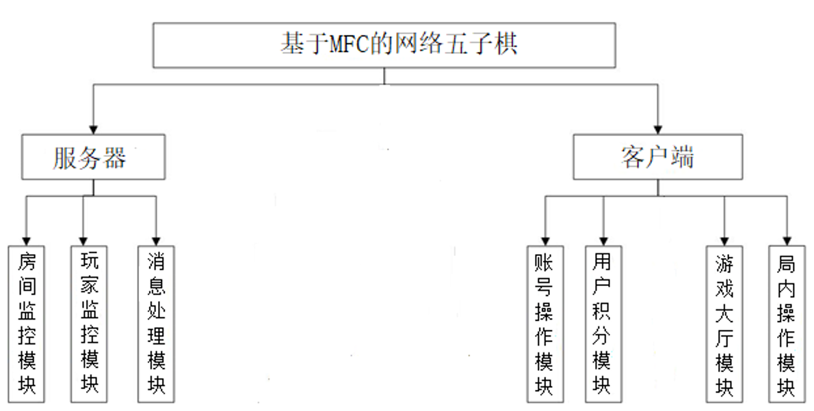{width="6.0993055555555555in"
height="3.0854166666666667in"}

图1.1 系统架构图

在服务端这里，具体模块可概括地分为房间监控模块、玩家监控模块和消息处理模块。其中房间监控模块负责对游戏中所有房间目前的在线人数进行实时显示。玩家监控模块负责的是对所有当前在线玩家的具体情况做监控，比如积分、当前所处房间、当前所处桌位等信息。而在消息处理模块，主要负责的就是响应客户端发送的连接请求，并对客户端发送过来的各种消息进行服务，其中客户端的消息类型根据实际操作情况可分为好几种，需要根据收到消息的头部进行判断，来执行相应的操作。

至于客户端这里，相应的模块可以大致分为账号操作模块、用户积分模块、游戏大厅模块、局内操作模块。其中，在账号操作模块内，主要是账号的注册、登录以及修改密码的操作，当进行这些操作时，需要将消息发送到服务端，由服务端进行判断处理，并从数据库读取或存储相关结果。在账号积分模块内，当游戏个人积分进行结算时，将消息发送给服务端，服务端在数据库中处理完后，再将结果发回给用户，然后再进行本地的积分更新显示。在游戏大厅模块中，涉及到的内容会比较多，包括加入房间、加入桌位、大厅消息发送等等，进行这些操作时，会将请求发给服务端，再由服务端把信息转发给符合接收条件的客户端。还有最后一个局内操作模块，自然就是负责五子棋局内相关的操作，比如悔棋、求和、认输、局内聊天这些，这些信息只需要由服务端转发给该名用户的对手即可。在本地客户端将消息发送给服务端时，会根据用户此时具体的操作情况，来发送不同的消息，具体的消息类型有注册、登录、修改密码、加入房间、加入桌位、游戏准备等。

## 本文组织结构

本文共分为6章。

第一章主要介绍了网络五子棋的背景和意义，以及课题在国内外的现状，同时讲述了本文主要的内容和工作。

第二章则是介绍了本课题需要应用到的相关技术与框架，包含MFC框架概述与消息映射机制，Winsock通讯技术与控件的使用，以及多线程编程技术的简介。

第三章对系统进行了分析和设计，其中有需求分析和可行性分析，最后讲解了系统的总架构，7个模块的功能设计和数据库设计。

第四章主要是阐述了系统的实现，有服务器数据的初始化，7个模块的具体实现方法和实际运行时效果图。

第五章主要是对整个系统的所有功能模块进行测试，同时也提及了测试的目的以及它在软件开发过程中的重要性。

第六章是对本文所设计的基于MFC的网络五子棋进行总结。

# 相关技术分析

## MFC框架

本次课题中用到的程序框架为MFC，并且可视化窗口界面也是由这个框架设计制作的，首先来介绍一下什么是MFC框架。[]{#_Toc72788674
.anchor}

### MFC框架概述

MFC它其实是一种简称，它代表的是微软公司开发的一个类库，即微软基础类库^\[1\]^。在这个类库中，有大量的Windows平台上开发所需的API，以C++的形式封装并整合起来，形成了一个个的类，最终集合为一个类库。同时MFC不仅仅是一个类库，它也可以作为应用程序的框架来使用。

当用户在集成开发环境中，建立一个以MFC为框架的工程时，开发环境就会自动建立许多必要的文件，这些文件已经帮开发人员配置好了参数。也正是因为在MFC内核拥有大量的封装内容，这使得开发人员在实际编程过程中，可以省去大量的时间去处理复杂重复的内容。在减少开发人员不必要的工作量的同时，又能让他专注于自己的编程逻辑，这样可以大大提高开发的效率。但也正是因为这样，MFC框架它本身是通用的，适用于大部分情况，所以没有特别的针对性，导致以MFC为框架设计的项目，会失去一部分的灵活性。但是因为MFC提供的封装是浅封装^\[2\]^，这就让性能损失效率比较低，在程序运行时的效率就会稳定在高效率的水平。

### 消息映射机制

除了上述讲的东西之外，MFC框架里最重要的一个机制，就是消息映射与命令传递的机制，它是在将Windows消息与API函数在应用程序执行过程中面向对象化的关键机制。

在Windows平台中，每一个执行中的程序，都拥有一个自己的消息循环过程^\[3\]^，当操作系统捕获到用户执行操作时发送的消息后，就会将该消息存入消息队列中，并由对应的窗口来决定该消息的处理方式。在MFC中消息类型一共有3种，分别为标准消息、命令消息以及通知类消息，每种消息类型都有不同的产生方式以及处理方法。为了简化Windows平台中的消息处理过程，MFC中设有一个消息流动的要求，根据该要求的机制，消息和处理程序被关联起来，每当出现一个消息时，程序就会查看属于自己的"消息映射表"^\[4\]^，从而判断出该消息属于哪个处理函数，在这张表中，消息与处理函数形成了一一对应的关系，而这也是MFC框架比较有特点的地方。

Windows程序的消息流动示意图如图2.1所示。

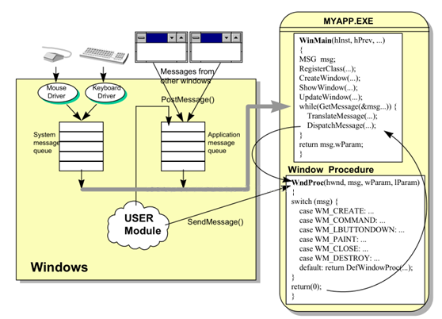{width="5.811805555555556in"
height="4.186805555555556in"}

图2.1 Windows消息流动示意图

### MFC与Qt框架的比较

除了MFC框架可以设计界面外，还有一种叫做Qt的图形界面开发框架。它也和MFC一样，能使用C++语言进行开发。

MFC与Qt都有着各自的优缺点，首先Qt它能够跨平台^\[5\]^，支持在多种平台如Linux上面进行开发，Qt的界面库还支持CSS，能够让界面设计更加美观与方便。同时Qt对于面向对象的特性比MFC体现的更加明显。

虽然Qt框架有着如此多的优点，但是MFC框架在Windows平台上的开发地位是毋庸置疑的，因为它封装了大量的Windows
API，同时比Qt拥有更加全面的库，运行程序时的效率高于Qt。由于本次程序是设计在Windows平台上的，为了不影响客户端与服务器之间的交互，就需要更加具有效率的程序，因此选择了使用MFC框架作为开发框架。

## Winsock通讯技术

在本次课题中，服务器与客户端之间能进行交互的重要桥梁，就是使用到的Winsock技术，它是一种常用的Socket。

Socket翻译过来，就是套接字的意思，它相当于一种通信接口^\[6\]^，拥有许多用于电脑间通信的功能与函数，并被打包在了DLL中，需要使用时直接调用相应函数即可。同时它也是双方间通信的一种约定，双方需要遵守套接字中所制定的规则才能进行通信。Socket相当于主机通信端点的抽象，这个端点表示在网络中应用进程通信的一端，它能够为正在通信的双方提供符合网络协议来进行数据交换的机制。

### Windows套接字

Winsock是Windows Socket的简称，表示的是Windows平台上的Socket套接字。

Winsock作为Windows平台上进行网络编程的规范^\[7\]^，它具有开放性、多样性的特点，能够支持市面上的多种协议，是目前收到广泛应用的网络编程接口。在MFC工程下，集成环境就能为我们提供WinSock控件，该控件就是基于Windows
Socket网络编程接口的，有了这个控件，就能让TCP/IP协议下的网络连接变得更为轻松、简单。

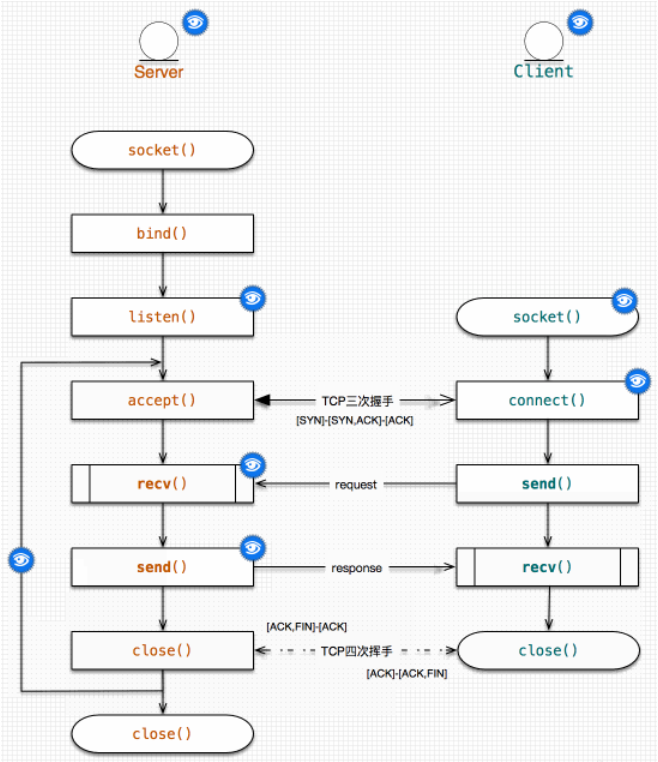{width="3.886111111111111in"
height="4.508333333333334in"}

图2.2 基于Winsock的典型应答型C/S通信流程图

### Winsock控件的使用

在MFC中，Winsock控件在程序运行期间是无法看到的，因为它不需要出现在可视化界面中，并且使用它时也不用去清楚它实现网络协议连接时的底层代码逻辑^\[8\]^，只要在项目中配置好该控件的属性，并在合适的地方去调用它自带的方法，就能够很容易地实现两端之间的通信，访问TCP/IP协议下的网络服务，进行双向的数据传输与交换。

基于Winsock的典型应答型C/S通信流程图如图2.2所示。

Winsock控件中最重要的两个属性是要连接到的远程主机的IP地址与端口号，在代码中配置好这些属性后，就可以通过调用Winsock内部的方法来与对方尝试进行连接，连接成功后，就能够与对方进行数据传输了。其中常用的几个方法有Listen、Connect、Accept、Send、Close等^\[9\]^，服务器在等待客户端连接之前，需要先进入监听状态，只有在监听状态下，当有客户端对自己发出了连接请求时，才能够成功建立连接。

## 多线程编程技术

在计算机中，进行工作的核心靠的是CPU，它负责计算机运行时所有的处理工作。每一个在计算机上运行的程序，都会由操作系统从可用资源中分配一个进程给它。而我们的CPU，在同一时刻只能处理单一进程，也就是说，当我们的计算机中有多个正在运行的程序时，即有多个进程需要被处理时，CPU只能一个一个地去处理。而在处理其中一项进程时，其他进程均处于阻塞状态，直到等待CPU来处理自己的时候。所谓的阻塞状态，就是当正在运行过程中的进程向操作系统请求资源调度等操作时^\[10\]^，由于操作系统正在忙于其他的服务或者进程，暂时无法及时对该进程进行响应，因此该进程只能先让自己进入阻塞状态，等待操作系统响应时，再将自己唤醒。当进程进入阻塞状态时，程序就无法及时响应并反馈用户发送的操作，对于用户来说，就好像程序出现了异常一般。

但是由于CPU的处理速度是非常快的，处理一个进程只需要极短的时间，因此即便有多个程序在同时运行，也会让用户觉得这些程序真的是在同时运行，而不是由CPU一个一个地处理过来的。而每个进程里面，又会有一到多个的线程，线程是每个进程中代码不同的执行路线，每个进程至少会拥有一个主线程^\[11\]^。在单线程程序中，所有用户的操作都由该进程的主线程来接收及完成，这种按照顺序来执行操作的程序，当用户操作过快时，很容易就会出现代码阻塞的情况，比如程序突然之间无响应或者页面进入假死状态等现象，基本都是因为程序为单线程处理。但是在多线程程序中，程序拥有多个线程，每个线程之间都是独立运行的，当程序有需要时，就会向内存申请新建一条新线程，获得对应的系统资源并由该线程进行处理操作，处理完毕后再关闭该线程，返还所占用的内存与系统资源。

在程序中使用多线程技术，可以极大地提升CPU的资源利用率^\[12\]^，让其在空闲状态下可以执行其他任务，并提高应用程序应用时的响应速度与表现，让用户获得良好的使用体验。同时对于开发者来说，采用多线程编程技术时便于理解，编程简单，因为多线程中的部分在编写时依然是按照顺序执行的原理，符合开发者的思维模式。然而尽管多线程模式有这么多的优点，但它也是一把双刃剑，必然拥有自身的一些缺点。首先一点就是会降低程序的运行效率，因为当进程中分配了多个线程时，操作系统就需要对每个线程的中间状态来进行维护，也就是要在它们之间来回进行切换以达到维护效果，这样就增加了更多CPU进行切换的时间，对性能有比较大的影响。同时当线程数量很多时，内存空间资源的占用也会逐渐提高，增加了系统的空间开销。最主要的一点就是，当有多个线程同时对程序中的全局数据进行操作时，很有可能会引起不必要的紊乱，若要解决这种问题还需要额外介入线程锁，这会大大增加开发的复杂性。因此，在何时使用多线程，如何使用多线程，也是需要学习和注意的。

## Client-Server结构

### C/S结构概述

本次毕设中，服务器与客户端之间使用的为两层C/S结构。即主要的业务数据由服务器来负责维护与管理^\[13\]^，而用户与整个程序间的交互动作，则由客户端来完成，这种结构是属于胖客户端的结构。客户端在使用网络连接到服务器后，通过客户端交互界面来接收用户的各种操作请求。在收到一次用户的请求后，就通过网络向服务器发出具体的请求，并由服务器连接到数据库来对业务数据进行操作。

该结构如今已经历经了成熟的发展，由于它具有安全可靠、交互性强等显著特点，因此这种结构被许多的项目所接受使用。C/S结构有着如下的优点^\[14\]^：

1.由于该结构是以客户端为载体的，可以很方便地设计用户的交互部分，具有丰富的界面与操作性。

2.业务数据都是由服务器连接数据库进行维护的，安全性得到了保障。

3.具有很快的响应速度，能够提升用户的使用体验。

同时C/S结构也有着部分缺点：

1.适用性不高，通常只适用于局域网范围。

2.需要下载并安装客户端才能够使用，不是特别方便。

3.当进行一次更新后，所有客户端程序都需要随之改变，维护的成本较高

### C/S与B/S结构的比较

而除了上述所说的C/S结构外，还有一种B/S结构，全程为Browser-Server，是基于浏览器的服务结构。与只有两层的C/S结构不同，B/S结构拥有三层，分别是表现层、逻辑层以及数据层。

B/S结构下的程序，只要使用Web浏览器就可以进行访问^\[15\]^，无需进行下载安装客户端这些繁琐的操作，简便性大大提升。虽然该结构与C/S结构相比特别方便，但是在B/S结构下，速度和安全性无法得到很好保障，与客户端相比，在浏览器上想达到这种效果是需要花费巨大的成本的，这也是B/S结构最大的问题。并且浏览器页面是无法做到实时刷新的，通常需要刷新页面才能够解决，这对于用户来说是非常影响体验的。

因此相比之下，最终还是选择了使用C/S结构来做为程序的交互模式。

# 系统分析与设计

## 需求分析

### 功能需求分析

在本次课题中设计的主要功能需求有三部分，分别是用户账号功能、游戏大厅功能、五子棋游玩功能。

1）用户账号功能

网络五子棋的实现基础是用户通过登录账号来连接到游戏，所有首先要实现的就是账号的注册和登录功能。当用户在登录时如果尚未拥有游戏账号，则可以自行选择打开到注册界面，在完成注册后再点击返回到登录界面。并且在注册界面，对用户的输入进行了校验，判断是否符合所设计的正则表达式。除了这些功能外，考虑到用户对账号的安全性问题，还增加了用户自行修改密码的功能，以不定期地提高账户的安全性。同时，每个账号都有属于自己的游戏积分，该游戏积分是跟随账号的，当用户切换新账号时原来的积分不会继承过来。当用户看着自己的积分随着游戏的进行而慢慢增加，五子棋技术也逐渐随之提升时，会有一种满满的成就感与养成感，可以使得用户的游戏体验良好。

2）游戏大厅功能

由于网络五子棋是可以与其他玩家在网络上进行对战的，因此需要和市面上主流的游戏对战平台相类似，也拥有一个游戏大厅的功能。在大厅中，用户能够看到当前在线玩家的情况，并且能够自主选择进入哪个房间，与哪一名玩家对战或者加入某张桌位中等待其他玩家加入。同时在大厅中，用户也要能看到其他玩家的游戏积分，增加用户的游戏挑战性，激发游玩的兴趣，也可以在大厅中与其他玩家发送信息进行交流。并且用户也能在大厅中查看个人的账号信息，在信息展示界面也可以选择是否修改密码以维持账号的安全性。

3）五子棋游玩功能

本次课题的核心部分就在于五子棋的游玩部分，如果玩不了五子棋，那么其他功能和模块的设计都相当于无用了。在这个功能中，用户可以和位于同桌位的另一名玩家进行对战，在对战过程中也支持悔棋、求和、认输这些五子棋中基本的功能。在一局对战结束后，再根据胜负情况来对两名用户的个人游戏积分进行增减判断，及时更新到界面中。同时用户在游戏中也可以在聊天频道中发送消息给对手玩家，增加游玩时的趣味性。

### 非功能需求

根据对现有游戏对战平台的观察，发现用户量大是一个比较需要重视的问题。当同时在线的用户数量很多时，服务器要能够承受得住。首先要解决的就是如何让服务器可以处理这么多用户的高并发请求，当在短时间内有大量用户发出请求时，服务器要能够一一处理，并且不能让用户感觉到明显的延迟，同时还要保证处理过程中数据不产生差错。高并发问题已经是目前C/S架构网络应用程序中重点需要解决的问题之一了^\[16\]^，毕竟在用户基数很高时极有可能导致服务端崩溃或者数据异常。

其次为了减少程序的复杂性，需要对注册时用户名和密码的输入进行限制，必须按照设计好的正则表达式来输入，当输入完毕后会先在本地进行判断，如果输入的内容没有符合规定的条件，就进行弹窗提示而不将信息发送给服务器。当输入符合条件时，会将信息包装为统一的格式发送服务器，再由服务器处理。这样的设计可以削减部分服务器代码的体量，并减少不必要的通信次数，提高程序运行效率。

最后考虑到安全性方面，程序在整个运行过程中，不会泄露任何用户的账号密码。用户与用户之间只能看到对方的用户名与游戏积分，无法得知任何关于密码的相关信息，同时也提供了用户自主修改密码的功能，并且要求新密码不能与旧密码一致，通过这些手段有效地提高了用户的账号安全性，使用户在使用过程中可以放心满意。

## 可行性分析

### 技术可行性分析

网络五子棋的所有可视化窗口界面以及操作交互控件，都是采用MFC框架来实现的。MFC框架是在微软VS集成环境下进行配置与使用的，并且带有许多的开发工具，可以让整个编码过程更为简单，减少不必要的工作量。同时MFC框架也有它独特的消息映射机制，该机制可以辅助开发者实现一些设计上的操作，并且该框架也能降低程序运行所损失的效率，对维持程序的性能有所帮助。

通信时所采用的套接字为异步套接字CAsyncSocket，整个通信过程均为异步通信，使用这种方式就能够有效避免在客户端与服务器通信时出现的阻塞问题^\[17\]^。若采用同步通信的方式，当其中一方向另一方发送消息时，必须等待对方返回，否则程序将一直处于阻塞状态，这对于用户来说，就像操作界面卡死了一样，非常影响使用体验，所以必须采用异步的方式。这种方式下发送消息后，无需等待对方返回，只要在对方处理完消息时随时发送回反馈就行了。

在用户账号管理这方面，使用到的数据库为MYSQL。它是一种关系型数据库^\[18\]^，适合存储并管理大量的数据，工作效率是人工管理与维护无法比拟的，它能够按照用户设置好的数据结构，建立相应的数据库与表。用户不仅可以通过可视化界面来操作数据库中的数据，也能通过使用SQL语句来执行增删改查等相关操作。SQL的全称叫做结构化查询语言，它是一种用于存取、查询、更新并更好地管理数据的程序设计语言，适用于关系型数据库，刚好能与MYSQL进行完美结合，开发者只要简单地掌握SQL语句就能够实现对数据库的维护与管理。

通过上述对相关技术的分析可以得出，基于MFC的网络五子棋在技术层面上来说是完全可行的。

### 经济可行性分析

在本次课题中使用到的MFC框架，是包含在VS集成开发工具内部的一种类库与框架，并且Winsock套接字也是封装在它内部的，这些都是开源且免费的，无需考虑经济问题。而储存数据用到的MYSQL也是面向大众免费使用的，不需要进行额外付费。所以使用到的框架与技术都是不用经济支出的，并且这些技术的性能与效率也比较强大。

通过上述分析得出，基于MFC的网络五子棋在经济层面上来说是完全可行的。

## 系统的总设计

由于整个网络五子棋的设计分为两大部分，即服务器与客户端，在每个部分各自的功能模块设计完后，还需要将两者结合起来。客户端和服务器设计结合后完整的系统业务流程图如图3.1所示。

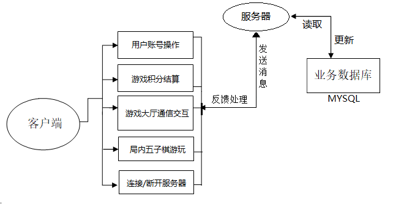{width="6.098611111111111in"
height="3.1631944444444446in"}

图3.1 业务流程图

业务数据库：该系统中需要用数据库存储的数据主要有账号的用户名、密码以及对应的游戏积分，所采用的数据库为MYSQL，由于数据之间的关系并不复杂，所以只需要简单地使用SQL语句就能对库中的数据进行管理操作。当客户端连接时，服务器会从数据库中读取数据再反馈过去，当接收到更新消息时，就会及时去更新库中存储的数据从而保证数据的一致性。

用户账号操作服务：这里采用的技术为正则表达式+数据库，在用户进行注册与修改密码时，先在本地对输入进行正则判断，通过验证时服务器再与数据库连接来管理数据。而在用户进行登录时，服务器会先在数据库中进行校验，校验通过后读取对应账号的信息发送给客户端。

游戏积分结算服务：这里直接与数据库相关联，当对局结束后，根据对局情况判断游戏积分变化，服务器连接数据库后进行积分更新并反馈至客户端。

游戏大厅通信交互服务：在游戏大厅中主要的交互操作是加入房间与加入桌位，服务器会将对应的房间与桌位信息全部发送给客户端，再由客户端接收并做处理然后显示在大厅界面上，这里用到的主要是继承异步套接字中的Send函数与框架中自动响应消息接收的OnReceive，其中OnReceive函数需要根据消息内容自己进行重写，并且使用了多线程技术防止程序阻塞，在子线程中运用了自定义消息来完成对主线程控件的访问。

局内五子棋游玩服务：该部分涉及到了MFC框架中的绘图，重写了OnPaint函数，游戏开始后会在窗口界面绘制出棋盘背景与网格，至于棋子与选中框会直接在画布控件中用画笔与画刷绘制出形状。同时还拥有悔棋、求和、认输以及聊天的功能，这些功能的实现也都与OnReceive函数的重写以及多线程有关，重点还是在于继承了CASyncSocket异步套接字。

连接/断开服务器服务：这里重写了OnClose与OnAccept函数，使用了list来存储连接到服务器的用户，并在对方断开连接时将其从list中移除掉。实现了两端可靠的TCP连接。

## 功能模块设计

{width="6.0993055555555555in"
height="3.0854166666666667in"}

图3.2 系统功能模块设计

整个网络五子棋的功能模块设计如图3.2所示，下面先详细介绍服务器的功能模块，再然后是客户端的部分。

### 房间监控模块

在该模块中，服务器窗口界面中会使用一个列表展示所有房间当前的在线情况，有利于服务器管理者清楚当前服务器具体负载的情况。

### 玩家监控模块

在该模块中，服务器窗口界面中会使用一个列表展示所有当前在线玩家的具体情况，包括用户名、游戏积分、所在房间、所在桌位、游戏状态，有利于服务器管理者对每个玩家的情况进行监控。

### 消息处理模块

在该模块中，服务器除了要与监听到的客户端进行连接，还需要根据接收到的消息内容来对客户端进行服务。

在连接客户端方面，会创建一个监听套接字与一个响应套接字list，使服务器在单线程下能够与多个客户端同时保持连接状态。

消息接收这里会在每次接收消息时，都新建一个子线程，在子线程中配合MFC自定义消息来执行相应的操作。并且会在套接字类中定义一个枚举类型，里面规定了各种消息头，并以每种枚举的整型数作为判断依据。同时还会在列表中展示接收到的消息，进行实时监控

至此，服务器的模块都介绍完了，下面将详细介绍客户端部分的功能模块。

### 账号操作模块

在这个模块中，最主要的功能是注册、登录以及修改密码。在客户端发出这些请求后，服务器会负责管理用户的账号操作部分，保证用户在进行游戏时账号的数据一致性。同时还要求客户端必须连接服务器登录账号后才能进入游戏，实现了真正意义上的网络五子棋的同时还保障了用户账号的安全性。

账号注册的流程图如图3.3所示。

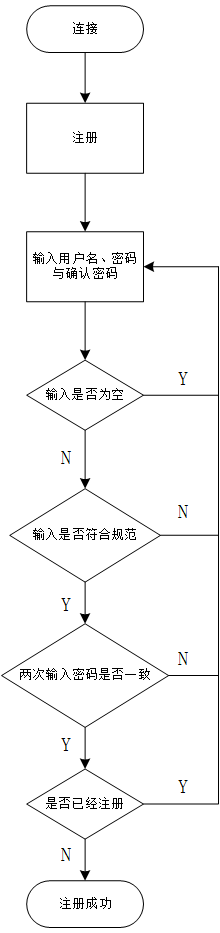{width="1.8333333333333333in"
height="7.7756944444444445in"}

图3.3 账号注册流程图

首先在注册部分中的任何输入都需要符合所规定的正则表达式，否则会一直提醒用户，让其无法发送注册消息给服务器。还要针对两次输入的密码进行校验，检查两次的输入内容是否一致，只有当这些都验证通过后，才会将注册消息及内容发给服务器由其处理。服务器收到注册消息时，先判断该注册的用户名是否存在于库中，如果已存在则告知反馈给客户端此用户名已被注册，若不存在则将相关信息新增写入到库中，并初始化游戏积分，这样就算注册成功了。

账号登录的流程图如图3.4所示。

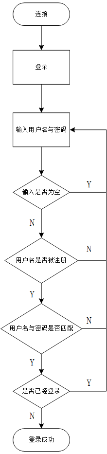{width="1.8333333333333333in"
height="7.7756944444444445in"}

图3.4 账号登录流程图

接着是在登录部分，客户端本地只对输入是否为空作判断，通过验证后直接发送登录消息及内容给服务器。在服务器收到登录消息时，也先判断该登录的用户名是否存在于库中，如果不存在则反馈此用户名尚未注册的信息给客户端。如果存在，则再判断输入的密码是否与库中密码对应，如果不对应则返回密码不正确的信息，如果正确则用户登录成功，并将对应账号的游戏积分读取出发送给用户。

修改密码的流程图如图3.5所示。

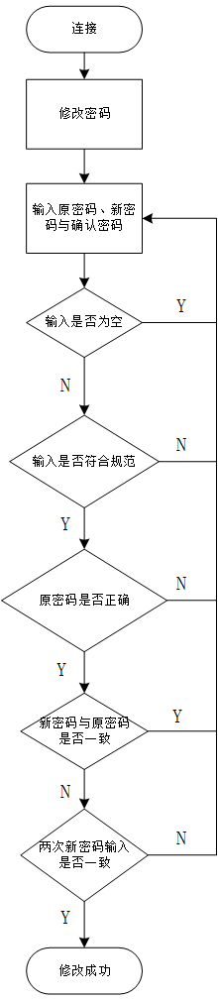{width="1.8333333333333333in"
height="8.165277777777778in"}

图3.5 修改密码流程图

最后是修改密码的部分，这里也需要符合密码的正则表达式，并且原密码输入要正确，同时这里还要额外判断新密码不能与原密码一致，否则不予修改。之后将消息发送给服务器，服务器在收到修改密码消息时，直接将新密码更新至库中对应账号的那条记录，覆盖旧密码即可。

### 用户积分模块

这个模块主要是负责每个账号游戏积分的正确性。当用户登录后，会先从服务器那边获取到自己的游戏积分，这样能保证积分永远是最新的，不会出现数据错误。而在对局结束后，积分发生变化时，本地会更新显示最新的积分，此时新积分已经在服务器那边被同步到了数据库中。

并且在游戏大厅与五子棋界面中，还能看到其他用户最新的积分，这些积分也都会随着他们的游戏情况而即时更新。

在客户端发出与积分相关的请求后，服务器会负责对每个用户的游戏积分进行更新，不仅仅针对每个用户自己，也包括与用户位于同房间以及同桌位的其他用户的积分情况更新。在每个对局结束后，服务器会根据游戏的实际情况来做处理，分为3种情况：胜利、失败、逃跑。

胜利时，该用户增加5点游戏积分；失败时，该用户减少3点游戏积分；逃跑时，该用户减少6点游戏积分，而对手按胜利来结算。这些增减操作都会在数据库中进行，保证下次登录时积分是一致的。并且在用户自己的积分更新后，该更新也将被同步到其他符合条件的用户那边，保证数据的即时性。

### 游戏大厅模块

这个模块是网络五子棋中，与局内操作模块一样是比较重要的一个模块，主要负责显示当前在线总人数、每个房间当前人数和桌位情况，以及当前房间中其他用户的信息，并且修改密码的功能入口也是在这个游戏大厅里的。所以说这个模块的信息接收量还是比较大的，房间中的用户相关信息，以及每个桌位的具体情况，都是随着其他用户的操作而即刻发生改变的。在这里使用多线程技术创建子线程来更新大厅界面是最合适的。

### 局内操作模块

在该模块中，用户要能够与对手进行五子棋游戏，需要在界面上显示棋盘背景与网格，以及鼠标移动到的位置要能显示出选中框。在一方落子后，双方界面这里都要绘制出新下的棋子，如果落子后游戏结束，除了要显示胜负信息并更新双方的积分外，还要额外显示出落子的顺序，从1开始依次标记。

在游戏过程中，也可以选择是否悔棋、求和、认输，同时也能够与对方发送聊天信息进行沟通。

## 数据库设计

该项目中使用的数据库为MYSQL，版本是比较新的8.0，它自带的默认存储引擎为InnoDB，它作为MYSQL上第一款能进行事务处理的数据存储引擎外，还能够支持外键约束。该引擎的设计目标就是最大化处理大量数据时的性能，在基于磁盘的关系型数据库引擎中，InnoDB的CPU利用效率是目前最高的，因此使用这个引擎作为MYSQL首选的默认引擎是再好不过了。

在本次项目中由于对数据的存储需求并不高，只需要保存每个已被注册的用户账号相关信息，包括用户名、密码、游戏积分，所以只需要设计一张表即可，表的设计与功能如表3.1所示：

> 1.user表：主要保存用户账号的信息。

表3.1 user表

  -------------- ------------ --------- ----------- ----------------------
      字段名       数据类型     长度     是否主键            描述

       Name        varchar       18         是            账号用户名

       Pwd         varchar       18                        账号密码

      Score          int         11                      账号游戏积分
  -------------- ------------ --------- ----------- ----------------------

# 系统实现

## 数据初始化

本项目要想能运行起来必须得先启动服务器进行监听，在启动监听前，为了保证客户端连接后程序的正确性，需要先行对服务器数据进行初始化工作。服务器要进行初始化的数据主要有所有房间信息、桌位信息、在线玩家信息、当前在线人数。

首先要对所有房间的信息进行初始化，包括房间号、房间名称、当前房间的在线人数情况。一共定义了20个房间，每个房间的房间号从1开始显示，每经过5个房间更换一轮房间名，并将所有房间的当前在线人数设初值为0。

接着要对所有桌位的信息初始化，默认每个房间拥有30个桌位，具体信息包括所属房间号、桌位号、桌位当前人数、玩家以及状态。每个桌位的从属房间号是从1开始自增，每连续30个桌位的从属房间号都是相同的，因为它们属于同一个房间。而桌位号也是从1开始记录，每30个桌位重置一轮计数，因为一个房间只拥有30个桌位。然后将所有桌位的当前人数设为0，当前玩家为"/"，桌位状态置为"free"，一开始是没有玩家的。

最后是在线玩家信息和当前在线人数这里，在线玩家信息表默认插入表头后不添加任何数据，因为服务器启动监听前肯定是没有任何玩家在线的，同样地将在线人数也先置为0显示即可。

## 功能模块实现

### 账号操作模块

整个模块主要分为3部分实现。

1.账号注册流程

用户在注册界面点击注册按钮向服务器发送请求之前，会先在本地对输入信息进行校验。首先会判断是否有输入为空值的，需要输入的包括用户名、密码、确认密码，其中任何一项输入为空值都无法通过验证。在通过空值验证后，会使用正则表达式对用户名和密码进行匹配。

账号注册的界面展示图如图4.1所示。

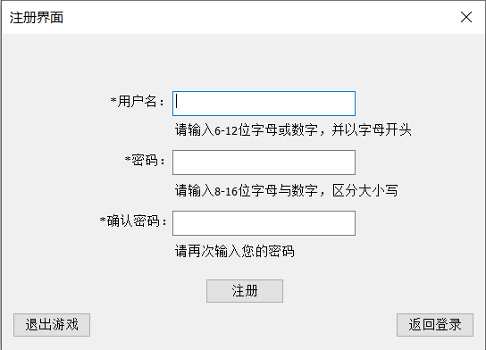{width="5.666666666666667in"
height="4.083333333333333in"}

图4.1 账号注册界面展示图

其中要求用户名是以字母开头的6到12位数字或字母组合，对应的表达式为\^\[a-zA-Z\]\[a-zA-Z0-9\]{5,11}，\^表示指示字符串的头，要求以它后面的字符开头，后面的\[a-zA-Z\]表示匹配任意一个大小写字母，最后的{5,11}表示任意5到11位的字母或者数字，整个表达式并在一起就达到了预期的规则。而密码的要求是8到16位数字与字母的组合，对应的表达式为\^(?=.\*\[a-zA-Z\])(?=.\*\[0-9\])\[a-zA-Z0-9\]{8,16}，其中?=是一种环视语法，它相当于一种判断条件，判断字符串中是否有符合它之后规定的条件，并没有实际占位。后面的.\*\[a-zA-Z\]表示匹配0到多个除了换行符外的任意字符加一个字母，同理后面的一串表示匹配0到多个除了换行符外的任意字符加一个数字，最后的{8,16}表示匹配8到16个字母或者数字，整个合并在一起，就形成了所设定好的规则。

当输入的内容也通过校验后，最后判断一下密码与确认密码中的输入是否一致，如果不一致再次提醒用户，如果一致的话，就将注册消息发送给服务器。服务器在收到消息后，首先根据用户需要注册的用户名，在数据库中查找是否已经被注册，如已经存在该账号，则反馈给客户端，若不存在则写入数据库，并将游戏积分初始化为0分。

2.账号登录流程

账号登录的界面展示图如图4.2所示。

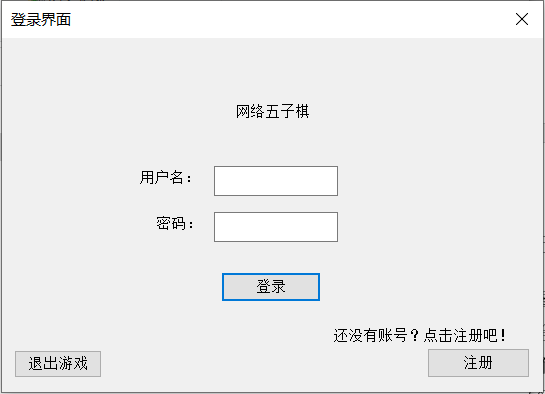{width="5.677083333333333in"
height="4.104166666666667in"}

图4.2 账号登录界面展示图

用户在登录界面试图进行登录时，也会先在本地对输入框中的内容进行判断，当输入验证合法后才会将登录消息发送到服务器。首先也是要判断输入是否为空，需要输入用户名与密码，均不允许输入为空。

当消息被发送到服务器时，服务器连接到数据库，首先要查询是否存在该用户名，如不存在，则反馈给客户端，如存在则继续对密码进行校验，在数据库中查询对应用户名那条记录的密码是否与用户输入的密码一致，如果不一致则反馈密码错误提示，如果一致则需要继续检查用户是否已经登录了，只有还未登录时，才能成功登录。登录成功后，将该账号对应的游戏积分以及所有房间的相关信息一并发送给客户端，更新服务器上在线人数与在线玩家监控信息，同时客户端将关闭掉登录窗口，打开并进入游戏大厅窗口。

3.修改密码流程

修改密码的界面展示图如图4.3所示。

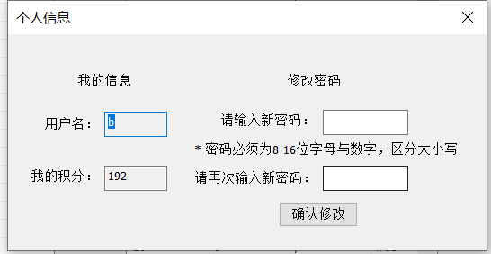{width="4.550694444444445in"
height="2.35in"}

图4.3 修改密码界面展示图

在游戏大厅中，点击个人信息按钮后，可以选择修改当前账号的密码，修改密码时的流程与注册时的大同小异，都需要符合正则表达式，新密码与再次输入的密码要一致，唯一有不同的地方在于，要在本地先进行判断，新密码不能与旧密码完全一致，否则不予修改。当用户发送修改密码的消息给服务器后，无需进行其他校验，直接连接数据库，修改对应用户名的密码字段即可。

### 用户积分模块 

积分结算时的胜负分为4种情况，有正常结束游戏、中途离开游戏、求和、提前认输。

当玩家通过上述4种方式中的任意一种结束了游戏时，根据双方玩家的胜负情况来对用户的积分作更新，首先在用户本地，游戏大厅窗口与五子棋游戏窗口更新显示双方的积分，同时服务器连接数据库对双方用户名下的游戏积分字段做更新，再更新服务器上在线用户监控信息，并且服务器还要通知所有与该对玩家处于同一房间下的其他用户，让他们在游戏大厅窗口上更新该对玩家最新的积分。

### 消息处理模块

在本程序中服务器与客户端能进行通信最重要的一步是使用套接字进行连接。由于采用的是异步套接字，虽然不会产生程序阻塞，但是在连续接收消息时容易产生消息错乱的问题。对此就需要使用多线程编程来防止这种现象。对于服务器，有两种解决方案，一种是每连接一个客户端，就创建一个子线程来为他进行服务，直到其断开连接。另一种是仅在进行消息接收时创建子线程进行处理直到处理完毕。这里考虑到服务器的性能影响以及代码实现的复杂性，采用了第二种方法。

每次监听到一个新客户端时，都创建一个响应套接字与其进行连接，然后存入list中，这样在保证主线程能与多个客户端进行连接的同时，还能够减少部分服务器性能的开支。然后重写响应套接字中的OnReceive函数，在里面创建子线程对消息进行接收与处理。而对于客户端来说，也需要在接收消息时创建子线程来防止消息接收错乱。但是子线程中是无法对主线程中的控件直接访问与操作的，所以使用了自定义消息，对操作窗口发送消息让主线程进行操作，就解决了这一问题。

服务器在对客户端发送的消息进行处理及监控的展示图如图4.4所示。

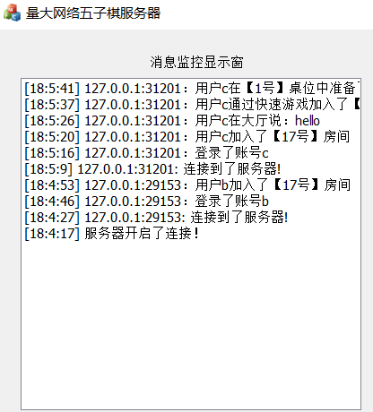{width="4.333333333333333in"
height="4.791666666666667in"}

图4.4 消息处理展示图

由于双方发送的消息种类繁多，为了让服务器与客户端明确知道对方发送消息以后想得到什么反馈，就需要自己添加消息头部来标识各种类型的消息，这里使用了枚举类型来进行标识。

### 房间监控模块

房间监控模块的展示图如图4.5所示。

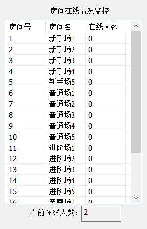{width="3.0833333333333335in"
height="4.802083333333333in"}

图4.5 房间监控展示图

该模块的实现方法是创建了一个GameList类，该类中存放了所有房间与桌位的相关信息，在服务器启动监听前，会先对这个类中的数据进行初始化。

之后每当一个用户加入某房间后，对应房间的在线用户就增加一位，同步更新到服务器监控列表中。

### 玩家监控模块

在这个模块中，每成功登录一名用户时，都会在玩家监控列表中插入对应的用户名、游戏积分、所在房间、所在桌位号以及游戏状态。该列表中的信息会随着玩家的具体操作而即时更新，同时在玩家退出游戏时也会将该名玩家的信息从列表中移除。

玩家监控的展示图如图4.6所示。

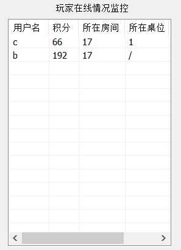{width="3.09375in"
height="4.260416666666667in"}

图4.6 玩家监控展示图

### 游戏大厅模块

游戏大厅模块的展示图如图4.7所示。

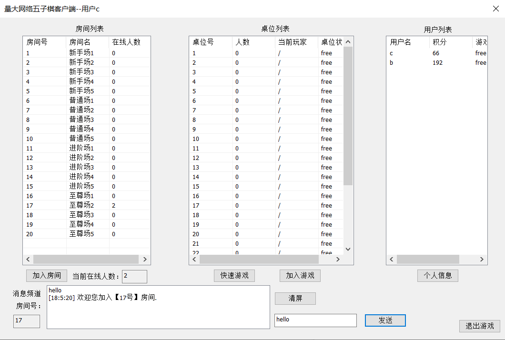{width="6.084027777777778in"
height="3.8826388888888888in"}

图4.7 游戏大厅展示图

这个模块算是客户端中与局内操作模块一样重要的模块了，该模块实现了类似QQ游戏大厅的基本功能，实现的所有功能如下：

1.房间桌位以及用户信息情况更新：

在打开游戏大厅窗口时会初始化所有最新的房间数据，并在加入某个房间后也会读取到该房间的所有桌位信息以及当前在线用户信息，这里主要是靠服务器的消息发送与转发实现的。

2.大厅聊天功能

在加入房间后用户可以发送聊天信息到频道中，位于同房间的用户均能看到此消息，主要靠服务器的消息转发来实现。

3.个人信息界面

玩家可以在游戏大厅中点击个人信息按钮，跳出个人信息的展示窗口，显示当前的用户名与积分，并可以在右侧选择修改密码。修改前会先将新密码与目前保存的旧密码Pwd进行校对，不一致的情况下才允许用户修改。

### 局内操作模块

游戏界面的展示图如图4.8所示。

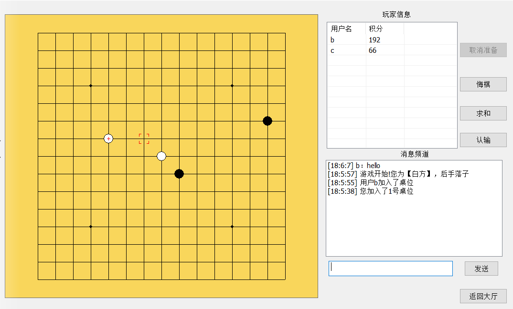{width="6.097222222222222in"
height="3.6847222222222222in"}

图4.8 游戏界面展示图

该模块实现了五子棋游戏界面，由如下部分组成：

1.棋盘与鼠标选中框绘制

棋盘部分的绘制由重写OnPaint函数实现，在玩家双方准备后，打开bIsReady状态，实现在OnPaint中执行绘制函数。

鼠标选中框信息由一个结构体数组构成，结构体中保存了选中框的x与y坐标，当鼠标移动到某个位置时，绘制出红色选中框，移动位置后，清除上一个选中框的绘制，并将目前的选中框信息赋值到上一个位置以覆盖。

2.五子棋核心算法

首先是五子棋算法部分，使用了一个结构体数组来保存棋子的信息，结构体中包含了有无棋子、棋子的颜色、x与y轴的坐标。游戏开始时，服务器会随机分配黑白方给双方的玩家，之后玩家根据自己的颜色次序开始下棋，以点击时离鼠标位置最近的棋格为基准，绘制棋子并将棋子信息存储到结构体数组中，同时在4个方向上查找是否达成同色五连子的条件

3.游戏结束后的复盘功能

当五子棋游戏结束后，将会即时清除棋子与选中框信息占用的资源，并在棋盘的每颗棋子上用数字标记落子的顺序，方便玩家查看对局情况。

游戏结束复盘的效果展示图如图4.9所示。

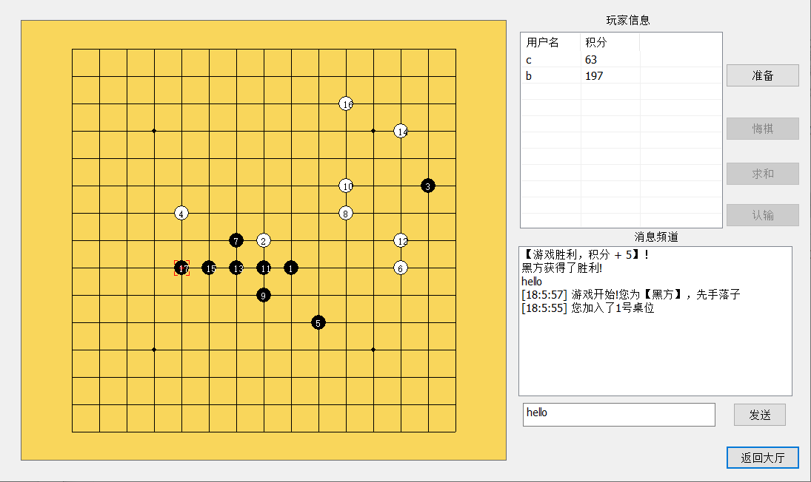{width="6.090972222222222in"
height="3.627083333333333in"}

图4.9 游戏结束复盘展示图

4.防止因拖动窗口而导致棋子绘制丢失的重绘功能

由于拖动窗口时，会发送消息给窗口，导致触发OnPaint函数，使得绘制好的棋子消失，只留下棋盘。因此设定了一个定时器，每隔一定时间能触发一下，重新绘制已存在的棋子。

5.悔棋、求和与认输功能

在游戏中支持玩家进行悔棋、求和以及认输的操作。

悔棋界面展示图如图4.10所示。

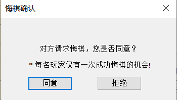{width="2.9166666666666665in"
height="1.65in"}

图4.10 悔棋界面展示图

进行悔棋时，会通过服务器将消息转发给对手，在对手的界面中弹出一个悔棋请求的弹窗，只有当对方同意时，才能成功悔棋，且一个人一局内只有一次机会。悔棋成功后，清除上一颗棋子的保存的信息，并使用背景重绘来覆盖取消落子的位置。

求和界面展示图如图4.11所示。

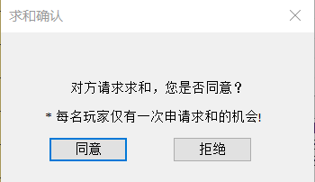{width="2.9166666666666665in"
height="1.6833333333333333in"}

图4.11 求和界面展示图

进行求和时，也是通过服务器将请求转发给对手，对手收到消息后会弹出一个求和请求的弹窗，如果对方同意，则双方会达成平局并进入游戏结束逻辑，游戏积分均不发生改变。但是无论对方是否同意，本局内己方就不能再申请求和了，通过点击求和按钮后使此按钮进入不可点击状态来实现。

认输界面展示图如图4.12所示。

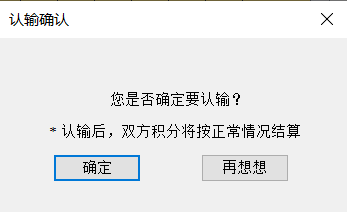{width="2.8916666666666666in"
height="1.7666666666666666in"}

图4.12 认输界面展示图

进行认输时，会在用户本地使用子线程来模态创建一个认输确认的对话框，这样做就不会阻塞主线程的消息。在用户确认认输后，服务器会将该消息转发到对手，同时游戏结束。

# 系统测试

##  软件测试的重要性和目的

我们身边平时常用的各种物品，如签字笔、便签本、自行车等等，在使用起来时都会觉得很舒适便捷，非常符合人体学，对于这点相信大家深有体会。但这些都是因为物品在设计之初时就充分考虑周全了吗？答案当然是否定的，还有很大一部分原因是经过了多种测试，才能产生现在的结果。上述这些物品，都是硬件，硬件需要经过测试。同理，软件当然也需要经过测试。

测试，顾名思义就是通过各种方法或手段来查看一件产品是否达到了预期的需求，是否产生了不希望发生的现象，这就是测试最基本的目的。软件测试与硬件测试最大的不同之处在于，软件的缺陷是无穷无尽的，永远也不会有一款不存在任何缺陷，完美的软件。这也是为什么会有所谓的软件危机这一现象，在软件开发和维护的过程中，人们对于软件的需求越来越复杂，要求越来越高，在实现新需求的同时必然会引起其他潜在的问题。并且这些存在的问题，越拖到后期，修复的代价就越惊人。为了尽可能的缓解这一现象，就需要测试人员来对软件进行充分的测试，尽早地发现更多的缺陷，同时让软件能尽可能地接近于完美，它的重要性是不言而喻的。

##  基于MFC的网络五子棋功能测试

### 账号操作功能测试

账号操作的功能测试一共分为账号注册，账号登录和修改密码这3个部分的系统功能测试。

表5.1 账号注册功能测试表

+----------------+------------------------------+--------------------------+----------------+
| 测试内容       | 用例描述                     | 期望输出                 | 测试结果       |
+----------------+------------------------------+--------------------------+----------------+
| 账号注册       | 用户有输入为空，点击注册按钮 | 提示请输入用户名或密码   | 通过           |
|                +------------------------------+--------------------------+----------------+
|                | 用户输入不符合规范的用户名   | 提示请输入正确的用户名   | 通过           |
|                +------------------------------+--------------------------+----------------+
|                | 用户输入不符合规范的密码     | 提示请输入正确的密码     | 通过           |
|                +------------------------------+--------------------------+----------------+
|                | 用户输入两次不一致的密码     | 提示密码与确认密码不一致 | 通过           |
|                +------------------------------+--------------------------+----------------+
|                | 用户输入已被注册的用户名     | 提示该用户名已被注册     | 通过           |
+----------------+------------------------------+--------------------------+----------------+

表5.1 账号注册功能测试表（续）

  ----------------- ------------------------------ -------------------------------- -----------------
  测试内容          用例描述                       期望输出                         测试结果

  账号注册          用户正确输入未被注册的用户名   提示注册成功，并在数据库中新增   通过
  ----------------- ------------------------------ -------------------------------- -----------------

表5.2 账号登录功能测试表

+----------------+------------------------------+--------------------------------+----------------+
| 测试内容       | 用例描述                     | 期望输出                       | 测试结果       |
+----------------+------------------------------+--------------------------------+----------------+
| 账号登录       | 用户有输入为空，点击登录按钮 | 提示请输入用户名或密码         | 通过           |
|                +------------------------------+--------------------------------+----------------+
|                | 用户输入错误的密码           | 提示用户密码输入错误           | 通过           |
|                +------------------------------+--------------------------------+----------------+
|                | 用户输入不存在的用户名       | 提示用户名不存在，请前往注册   | 通过           |
|                +------------------------------+--------------------------------+----------------+
|                | 用户尝试登录已登录的账号     | 提示该账号已登录，请勿重复登录 | 通过           |
|                +------------------------------+--------------------------------+----------------+
|                | 用户输入正确的用户名与密码   | 登录成功，进入游戏大厅界面     | 通过           |
+----------------+------------------------------+--------------------------------+----------------+

表5.3 修改密码功能测试表

+----------------+----------------------------------+----------------------------------+----------------+
| 测试内容       | 用例描述                         | 期望输出                         | 测试结果       |
+----------------+----------------------------------+----------------------------------+----------------+
| 修改密码       | 用户有输入为空，点击修改按钮     | 提示请输入原密码/新密码/确认密码 | 通过           |
|                +----------------------------------+----------------------------------+----------------+
|                | 用户输入的原密码不正确           | 提示请输入正确的原密码           | 通过           |
|                +----------------------------------+----------------------------------+----------------+
|                | 用户输入的新密码不符合规范       | 提示请输入正确的密码             | 通过           |
|                +----------------------------------+----------------------------------+----------------+
|                | 用户输入的新密码与确认密码不一致 | 提示请输入一致的密码             | 通过           |
|                +----------------------------------+----------------------------------+----------------+
|                | 用户输入的新密码与原密码相同     | 提示新密码不能与原密码一致       | 通过           |
|                +----------------------------------+----------------------------------+----------------+
|                | 用户输入正确的原密码与新密码     | 修改密码成功，数据库中进行更新   | 通过           |
+----------------+----------------------------------+----------------------------------+----------------+

### 游戏大厅功能测试

游戏大厅的功能测试分为了游戏房间、游戏桌位、大厅界面这3个部分的系统功能测试。

表5.4 游戏房间功能测试表

+----------------+--------------------------------------------------------+----------------------------------------------------------------------------------------------------+----------------+
| 测试内容       | 用例描述                                               | 期望输出                                                                                           | 测试结果       |
+----------------+--------------------------------------------------------+----------------------------------------------------------------------------------------------------+----------------+
| 游戏房间       | 登录账号进入游戏大厅，未加入房间之前，查看房间列表信息 | 房间列表展示了所有房间的名称以及对应在线的人数。                                                   | 通过           |
|                +--------------------------------------------------------+----------------------------------------------------------------------------------------------------+----------------+
|                | 没有选中列表中的房间时，直接点击加入房间按钮           | 提示请先选择一个房间                                                                               | 通过           |
|                +--------------------------------------------------------+----------------------------------------------------------------------------------------------------+----------------+
|                | 在列表中选中某个房间后，点击加入房间按钮               | 成功加入房间，接收该房间所有桌位与玩家的信息情况并展示出来。房间列表中对应房间的在线人数增加。     | 通过           |
|                +--------------------------------------------------------+----------------------------------------------------------------------------------------------------+----------------+
|                | 在房间中时，有其他玩家加入本房间                       | 频道中提示某用户加入了本房间，并在玩家信息列表中增加此玩家的信息。房间列表中对应房间在线人数增加。 | 通过           |
|                +--------------------------------------------------------+----------------------------------------------------------------------------------------------------+----------------+
|                | 在房间中时，有其他玩家离开了本房间                     | 频道中提示某用户离开了本房间，并在玩家信息列表中移除此玩家的信息。房间列表中对应房间在线人数减少。 | 通过           |
+----------------+--------------------------------------------------------+----------------------------------------------------------------------------------------------------+----------------+

表5.5 游戏桌位功能测试表

+----------------+--------------------------------+------------------------------------------------------+----------------+
| 测试内容       | 用例描述                       | 期望输出                                             | 测试结果       |
+----------------+--------------------------------+------------------------------------------------------+----------------+
| 游戏桌位       | 不选中桌位时，直接点击加入桌位 | 提示请先选择一个桌位                                 | 通过           |
|                +--------------------------------+------------------------------------------------------+----------------+
|                | 加入一个目前没有玩家的桌位     | 隐藏游戏大厅界面，打开游戏界面，列表显示自己的信息。 | 通过           |
+----------------+--------------------------------+------------------------------------------------------+----------------+

表5.5 游戏桌位功能测试表（续）

+----------------+--------------------------------+------------------------------------------------------------------------+----------------+
| 测试内容       | 用例描述                       | 期望输出                                                               | 测试结果       |
+----------------+--------------------------------+------------------------------------------------------------------------+----------------+
| 游戏桌位       | 加入一个目前拥有1名玩家的桌位  | 隐藏游戏大厅界面，打开游戏界面，列表同时显示该名玩家和自己的信息       | 通过           |
|                +--------------------------------+------------------------------------------------------------------------+----------------+
|                | 加入一个目前拥有2名玩家的桌位  | 提示该桌位人数已满                                                     | 通过           |
|                +--------------------------------+------------------------------------------------------------------------+----------------+
|                | 同房间的其他玩家加入了某个桌位 | 桌位列表中对应桌位的人数、状态发生改变，并在当前玩家中显示该用户的昵称 | 通过           |
|                +--------------------------------+------------------------------------------------------------------------+----------------+
|                | 同房间的其他玩家离开了某个桌位 | 桌位列表中对应桌位的人数、状态发生改变，并在当前玩家中移除该用户的昵称 | 通过           |
+----------------+--------------------------------+------------------------------------------------------------------------+----------------+

表5.6 大厅界面功能测试表

+----------------+--------------------------------------------------------+-----------------------------------------------------------------------------------------------------------------------+----------------+
| 测试内容       | 用例描述                                               | 期望输出                                                                                                              | 测试结果       |
+----------------+--------------------------------------------------------+-----------------------------------------------------------------------------------------------------------------------+----------------+
| 大厅界面       | 登录账号进入游戏大厅，未加入房间之前，查看大厅界面信息 | 正确显示了当前在线的玩家总数量，并且当前房间的显示框显示为"/"，聊天频道的发送按钮无法点击，右侧玩家信息列表中没有内容 | 通过           |
|                +--------------------------------------------------------+-----------------------------------------------------------------------------------------------------------------------+----------------+
|                | 加入某个房间后，查看大厅界面信息                       | 当前房间的显示框显示为对应房间的房间号，聊天频道的发送按钮可以点击，右侧玩家信息列表中显示该房间中所有玩家的信息。    | 通过           |
|                +--------------------------------------------------------+-----------------------------------------------------------------------------------------------------------------------+----------------+
|                | 其他玩家上线                                           | 在线总人数显示增加                                                                                                    | 通过           |
+----------------+--------------------------------------------------------+-----------------------------------------------------------------------------------------------------------------------+----------------+

表5.6 大厅界面功能测试表（续）

+----------------+--------------------------+--------------------------------------------+----------------+
| 测试内容       | 用例描述                 | 期望输出                                   | 测试结果       |
+----------------+--------------------------+--------------------------------------------+----------------+
| 大厅界面       | 其他玩家离线             | 在线总人数显示减少                         | 通过           |
|                +--------------------------+--------------------------------------------+----------------+
|                | 同房间其他玩家开始了游戏 | 对应桌位状态变更，玩家状态变更             | 通过           |
|                +--------------------------+--------------------------------------------+----------------+
|                | 同房间其他玩家结束了游戏 | 对应桌位状态变更，玩家状态与积分变更       | 通过           |
|                +--------------------------+--------------------------------------------+----------------+
|                | 点击个人信息按钮         | 打开个人信息展示弹窗，显示当前用户名与积分 | 通过           |
+----------------+--------------------------+--------------------------------------------+----------------+

### 五子棋对战功能测试

表5.7 五子棋对战功能测试表

+----------------+--------------------------------------+------------------------------------------------------------+----------------+
| 测试内容       | 用例描述                             | 期望输出                                                   | 测试结果       |
+----------------+--------------------------------------+------------------------------------------------------------+----------------+
| 五子棋对战     | 等待过程中，查看游戏界面元素         | 可以点击准备按钮，而悔棋、求和、认输按钮置灰               | 通过           |
|                +--------------------------------------+------------------------------------------------------------+----------------+
|                | 在等待过程中，其他用户加入           | 频道中显示该用户加入，并在列表显示该用户信息               | 通过           |
|                +--------------------------------------+------------------------------------------------------------+----------------+
|                | 在等待过程中，其他用户离开           | 频道中显示该用户离开，并在列表移除该用户信息               | 通过           |
|                +--------------------------------------+------------------------------------------------------------+----------------+
|                | 在游戏界面中，发送聊天信息           | 同桌位的另一名用户可以看到该条信息                         | 通过           |
|                +--------------------------------------+------------------------------------------------------------+----------------+
|                | 点击准备，查看按钮变化               | 准备按钮更改显示为取消准备                                 | 通过           |
|                +--------------------------------------+------------------------------------------------------------+----------------+
|                | 点击取消准备，查看按钮变化           | 取消准备按钮更改显示为准备，并同步取消服务器中的准备状态   | 通过           |
|                +--------------------------------------+------------------------------------------------------------+----------------+
|                | 双方用户都点击准备，查看游戏界面变化 | 准备按钮置灰，悔棋、求和、认输按钮可点击。棋盘界面成功绘制 | 通过           |
+----------------+--------------------------------------+------------------------------------------------------------+----------------+

表5.7 五子棋对战功能测试表(续)

+----------------+--------------------------------------+----------------------------------------------------------------------------------------+----------------+
| 测试内容       | 用例描述                             | 期望输出                                                                               | 测试结果       |
+----------------+--------------------------------------+----------------------------------------------------------------------------------------+----------------+
| 五子棋对战     | 点击返回大厅按钮                     | 弹出确认窗口                                                                           | 通过           |
|                +--------------------------------------+----------------------------------------------------------------------------------------+----------------+
|                | 等待过程中，返回到游戏大厅           | 提示对方自己离开了桌位，无积分变化                                                     | 通过           |
|                +--------------------------------------+----------------------------------------------------------------------------------------+----------------+
|                | 游戏过程中，返回到游戏大厅           | 提示对手自己离开了桌位，且游戏结束。对方增加5积分，自己扣除6积分                       | 通过           |
|                +--------------------------------------+----------------------------------------------------------------------------------------+----------------+
|                | 在未轮到自己时，左键点击棋盘尝试下棋 | 无法在对方回合下棋                                                                     | 通过           |
|                +--------------------------------------+----------------------------------------------------------------------------------------+----------------+
|                | 在自己回合时，点击悔棋               | 提示请在对方回合内悔棋                                                                 | 通过           |
|                +--------------------------------------+----------------------------------------------------------------------------------------+----------------+
|                | 在对方回合时，点击悔棋               | 在对方界面中弹出悔棋请求确认窗口                                                       | 通过           |
|                +--------------------------------------+----------------------------------------------------------------------------------------+----------------+
|                | 悔棋弹窗中点击确认                   | 请求方频道中提示对方同意悔棋，最后一颗落子从棋盘中清除，且请求方在该局内不能再申请悔棋 | 通过           |
|                +--------------------------------------+----------------------------------------------------------------------------------------+----------------+
|                | 悔棋弹窗中点击拒绝                   | 请求方频道中提示对方拒绝悔棋                                                           | 通过           |
|                +--------------------------------------+----------------------------------------------------------------------------------------+----------------+
|                | 点击求和按钮                         | 在对方界面中弹出求和请求确认窗口                                                       | 通过           |
|                +--------------------------------------+----------------------------------------------------------------------------------------+----------------+
|                | 求和弹窗中点击确认                   | 游戏结束，双方提示达成平局，且积分均不发生变化                                         | 通过           |
|                +--------------------------------------+----------------------------------------------------------------------------------------+----------------+
|                | 求和弹窗中点击拒绝                   | 请求方频道中提示对方拒绝求和，且本局内不能再申请求和                                   | 通过           |
|                +--------------------------------------+----------------------------------------------------------------------------------------+----------------+
|                | 点击认输按钮                         | 在界面中弹出认输确认窗口                                                               | 通过           |
+----------------+--------------------------------------+----------------------------------------------------------------------------------------+----------------+

表5.7 五子棋对战功能测试表(续)

+----------------+--------------------------------------------+-------------------------------------------------------------------------------------------------------------+----------------+
| 测试内容       | 用例描述                                   | 期望输出                                                                                                    | 测试结果       |
+----------------+--------------------------------------------+-------------------------------------------------------------------------------------------------------------+----------------+
| 五子棋对战     | 认输弹窗中点击确认                         | 游戏结束，我方积分扣除3，对方积分增加5                                                                      | 通过           |
|                +--------------------------------------------+-------------------------------------------------------------------------------------------------------------+----------------+
|                | 认输弹窗中点击取消                         | 弹窗关闭，游戏继续进行                                                                                      | 通过           |
|                +--------------------------------------------+-------------------------------------------------------------------------------------------------------------+----------------+
|                | 游戏过程中，自己回合内左键点击有棋子的位置 | 点击无反应，无法覆盖棋子                                                                                    | 通过           |
|                +--------------------------------------------+-------------------------------------------------------------------------------------------------------------+----------------+
|                | 游戏过程中，自己回合内左键点击无棋子的空位 | 棋子在正确位置被绘制，并轮到对方开始落子                                                                    | 通过           |
|                +--------------------------------------------+-------------------------------------------------------------------------------------------------------------+----------------+
|                | 己方落子后达成游戏胜利的条件               | 自己与对方都进入游戏结束状态                                                                                | 通过           |
|                +--------------------------------------------+-------------------------------------------------------------------------------------------------------------+----------------+
|                | 对方落子后达成游戏胜利的条件               | 自己与对方都进入游戏结束状态                                                                                | 通过           |
|                +--------------------------------------------+-------------------------------------------------------------------------------------------------------------+----------------+
|                | 游戏结束后，查看界面情况                   | 棋盘上的棋子按落子顺序从1开始标记，准备按钮可点击，悔棋、求和以及认输按钮置灰，双方积分按照实际情况进行变更 | 通过           |
|                +--------------------------------------------+-------------------------------------------------------------------------------------------------------------+----------------+
|                | 游戏结束后，双方再次准备                   | 棋盘重新绘制，游戏正常开始                                                                                  | 通过           |
+----------------+--------------------------------------------+-------------------------------------------------------------------------------------------------------------+----------------+

经过上面几个部分的测试，最终可以明确整个系统的功能是完善的。

# 总结

本文首先介绍了一下网络五子棋的背景意义以及在国内外的发展现状，之后详细说明了程序中使用到的相关技术。接着是对需求分析以及可行性分析的描述，介绍了需要完成哪些功能以及在各方面上实现程序的可行性。然后是对设计好的各功能模块的介绍以及在实现过程中相关技术的应用，同时也展示了程序运行时的部分界面截图。最后是对整个程序进行了功能测试，保证所有功能模块都如预期一样正常运行。

网络五子棋服务器部分完成的工作如下：

1.响应连接请求，同时为一到多个客户端进行服务。

2.对客户端发送过来的各种消息进行接收处理，并根据具体情况进行消息转发与反馈。

3.通过数据库来维护用户的账号数据。

网络五子棋客户端部分完成的工作如下

1.用户的注册、登录功能，并使用正则表达式对输入内容进行规范。

2.游戏大厅功能，可以看到所有房间与桌位的信息，显示同房间的玩家信息，在房间中与其他玩家进行交流，能自由选择加入游戏，并可以在个人信息查看界面选择修改密码。

3.账号积分功能，用户的积分与账号绑定，可以通过游戏来改变自己的积分，也能看到其他玩家的积分

4.五子棋游戏功能，可以与另一名玩家进行对战，对战过程中可以支持悔棋、求和以及认输，游戏结束后能看到落子的顺序标记。

整个程序的完成完整经历了需求分析、系统设计、界面设计、编码、测试等步骤，同时借阅大量文献资料，并结合已掌握和自学的技术来完成相应功能，在不明白的地方也得到了周老师的指点。

虽然本程序可以正常运行，但同时也存在 一些不足之处：

1.现在的界面还不是很符合大部分用户的审美，希望在以后学习的过程中能够得到改善，使得用户的图形界面更加美观。

2.没有在数据库中统计每名用户的胜负总局数，无法计算出每名用户的胜率，这点也需要改进，使得游戏大厅的界面功能更接近现有的网络游戏大厅。

3.用户在发送消息时，如果输入了中文会导致显示乱码，这是字符编码导致的问题，之后也需要进行完善。

4.用户在选择加入游戏房间时，没有增加游戏积分的限制，应该逐步提高每个游戏房间进入的积分门槛，这点需要之后完善。

[]{#_Toc72788718 .anchor}参考文献

1.  甄力,郭宝增.MFC中的消息映射和命令传递\[J\].计算机与数字工程,2005(07):46-48.

2.  王香菊.VC++使用Winsock
    API实现网络通讯的方法\[J\].通讯世界,2016(13):100-101.

3.  吕娜.Winsock控件的属性及应用方法\[J\].科技视界,2016(09):250.

4.  万坤,苏雪莲,冉瑞生.基于C/S架构的五子棋游戏软件的设计与实现\[J\].电脑知识与技术,2019,15(22):94-96+102.

5.  陈雪荣,岳书丹.基于Java的五子棋游戏的设计与实现\[J\].信息系统工程,2020(08):104-105.

6.  季丽琴.基于MFC的简易计算器制作\[J\].智能计算机与应用,2019,9(06):269-270.

7.  蒋达.基于Socket的网络接口编程\[J\].办公自动化,2018,23(23):29-30+32.

8.  宋毅.基于VS的网络聊天室设计与实现\[J\].电脑知识与技术,2020,16(17):85-86.

9.  周亚文.以MFC为框架实现C/S通信的Socket编程\[J\].数码世界,2018(08):28-29.

10. 刘倚彤.用Java实现五子棋人人对弈\[J\].电脑编程技巧与维护,2019(11):11-12+37.

11. 胡强.MySQL数据库常见问题分析与研究\[J\].电脑编程技巧与维护,2019(12):91-92.

12. 周超,刘传琦.基于VC的传输文件集成软件的设计与实现\[J\].无线互联科技,2019,16(12):57-59.

13. 黄汉堂,舒子谦.C#多线程的实践\[J\].电子制作,2019(20):63-65.

14. WT Handoko,Handoko WT,Ardhianto E,Hadiono K,Sutanto FA. Protecting
    Data By Socket Programming Steganography\[J\]. IOP Conference
    Series: Materials Science and Engineering,2020,879(1).

15. Xiyue Yan,Jianhua Yang,Wei Lu. Design of Remote GPRS-based Gas Data
    Monitoring System\[J\]. IOP Conference Series: Earth and
    Environmental Science,2018,108(4).

16. Zhuolin Mao. Design and Implementation of Computer Rank Examination
    System based on Winsock\[P\]. Proceedings of the 2016 International
    Conference on Education, Management, Computer and Society,2016.

17. 

[]{#_Toc72788719 .anchor}作者简历表

+:---------------:+:-------------:+:-------------:+:-------------:+:-------------:+:-------------:+
| 姓 名           | 赵杰          | 出生年月      | 1999.7.23     | 性 别         | 男            |
+-----------------+---------------+---------------+---------------+---------------+---------------+
| 教育经历                                                                                        |
+-----------------+-------------------------------+-----------------------------------------------+
| 起止时间        | 学习/工作单位                 | 所学专业/所从事学科领域                       |
+-----------------+-------------------------------+-----------------------------------------------+
| 2011.9-2014.6   | 杭州市拱宸中学                | 初中学习                                      |
+-----------------+-------------------------------+-----------------------------------------------+
| 2014.9-2017.6   | 杭州市西湖高级中学            | 高中学习                                      |
+-----------------+-------------------------------+-----------------------------------------------+
| 2017.9-2021.6   | 中国计量学院现代科技学院      | 计算机科学与技术专业                          |
|                 |                               |                                               |
|                 | 信息工程学院                  |                                               |
+-----------------+-------------------------------+-----------------------------------------------+
|                 |                               |                                               |
+-----------------+-------------------------------+-----------------------------------------------+
| 工作经历                                                                                        |
+-----------------+-------------------------------+-----------------------------------------------+
| 无              | 无                            | 无                                            |
+-----------------+-------------------------------+-----------------------------------------------+
|                 |                               |                                               |
+-----------------+-------------------------------+-----------------------------------------------+
| 本科在读期间发表的论文                                                                          |
+-----------------+-------------------------------+-----------------------------------------------+
| 论文（著）题目  | 期刊名称、卷次                | 发表时间                                      |
+-----------------+-------------------------------+-----------------------------------------------+
| 无              | 无                            | 无                                            |
+-----------------+-------------------------------+-----------------------------------------------+
|                 |                               |                                               |
+-----------------+-------------------------------+-----------------------------------------------+
| 本科在读期间完成的其他工作                                                                      |
+-------------------------------------------------------------------------------------------------+
| 2018 获得全国大学生数学建模竞赛成功参赛奖                                                       |
|                                                                                                 |
| 2018.04 优秀学生三等奖学金                                                                      |
|                                                                                                 |
| 2018.10,2019.04,2019.10,2020.04,2020.10 连续获得社会工作奖学金5次                               |
+-------------------------------------------------------------------------------------------------+

[]{#_Toc212703245 .anchor}学位论文数据集

+:-------------:+:-------------:+:-------------:+:-------------:+:-------------:+:-------------:+:-------------:+--------------:+--------------:+---------------+--------------:+--------------:+--------------:+---------------+--------------:+--------------:+:-------------:+
| 关键词\*                                                                                                      | 密级\*                                        | 中图分类号\*                                                                                  | UDC           |
+---------------------------------------------------------------------------------------------------------------+-----------------------------------------------+-----------------------------------------------------------------------------------------------+---------------+
| MFC；Winsock通讯；多线程                                                                                      | 公开                                          | TP391                                                                                         | 004           |
+---------------+-----------------------------------------------------------------------------------------------+-----------------------------------------------+-----------------------------------------------------------------------------------------------+---------------+
| 论文赞助      |                                                                                                                                                                                                                                                               |
+---------------+-----------------------------------------------+-------------------------------------------------------------------------------+-------------------------------------------------------------------------------+-----------------------------------------------+
| 学位授予单位\*                                                | 学位授予单位代码\*                                                            | > 学位类别\*                                                                  | > 学位级别\*                                  |
+---------------------------------------------------------------+-------------------------------------------------------------------------------+-------------------------------------------------------------------------------+-----------------------------------------------+
| 中国计量大学现代科技学院                                      | 13292                                                                         | 工学                                                                          | 学士                                          |
+-------------------------------+-------------------------------+-------------------------------------------------------------------------------+-------------------------------------------------------------------------------+-------------------------------+---------------+
| 论文题名\*                    | 基于MFC的网络五子棋                                                                                                                                                                                                           | 论文语种\*    |
+-------------------------------+-------------------------------------------------------------------------------------------------------------------------------------------------------------------------------------------------------------------------------+---------------+
| 并列题名\*                    | Network Gobang Based on MFC                                                                                                                                                                                                   | 简体中文      |
+-------------------------------+---------------------------------------------------------------+-------------------------------+-------------------------------------------------------------------------------------------------------------------------------+---------------+
| 作者姓名\*                    | 赵杰                                                          | 学号\*                        | 1732332218                                                                                                                                    |
+-------------------------------+-----------------------------------------------+---------------+-------------------------------+---------------------------------------------------------------------------------------------------------------+-------------------------------+
| 培养单位名称\*                | 培养单位代码\*                                | 培养单位地址                                                                                                                                                  | > 邮编                        |
+-------------------------------+-----------------------------------------------+---------------------------------------------------------------------------------------------------------------------------------------------------------------+-------------------------------+
| 中国计量大学                  | 13292                                         | 浙江省金华市义乌市大学路8号                                                                                                                                   | 322002                        |
|                               |                                               |                                                                                                                                                               |                               |
| 现代科技学院                  |                                               |                                                                                                                                                               |                               |
+-------------------------------+---------------+-------------------------------+-----------------------------------------------------------------------------------------------+-----------------------------------------------+---------------+-------------------------------+
| 学科专业\*                                    | > 研究方向\*                                                                                                                  | 学制\*                                        | 学位授予年\*                                  |
+-----------------------------------------------+-------------------------------------------------------------------------------------------------------------------------------+-----------------------------------------------+-----------------------------------------------+
| 计算机科学与技术                              | 程序研究 计算机应用                                                                                                           | 4年                                           | 2026                                          |
+-------------------------------+---------------+-------------------------------------------------------------------------------------------------------------------------------+-----------------------------------------------+-----------------------------------------------+
| 论文提交日期\*                | 2026.4                                                                                                                                                                                                                                        |
+-------------------------------+---------------------------------------------------------------+-------------------------------+-----------------------------------------------------------------------------------------------------------------------------------------------+
| 导师姓名\*                    | 周永霞                                                        | 职称\*                        | 副教授                                                                                                                                        |
+-------------------------------+---------------------------------------------------------------+-------------------------------+---------------------------------------------------------------+-------------------------------------------------------------------------------+
| 评阅人                        |                                                               | 答辩委员会主席\*                                                                              | 卢飒                                                                          |
+-------------------------------+---------------------------------------------------------------+-----------------------------------------------------------------------------------------------+-------------------------------------------------------------------------------+
| 答辩委员会成员                |                                                                                                                                                                                                                                               |
+-------------------------------+-----------------------------------------------------------------------------------------------------------------------------------------------------------------------------------------------------------------------------------------------+
| 电子版论文提交格式 文本（√ ）图像（ ）视频（ ）音频（ ）多媒体（ ）其他（ ）                                                                                                                                                                                                  |
|                                                                                                                                                                                                                                                                               |
| 推荐格式：application/msword；application/pdf                                                                                                                                                                                                                                 |
+---------------------------------------------------------------+-----------------------------------------------------------------------------------------------------------------------------------------------+---------------------------------------------------------------+
| 电子版论文出版（发布者）                                      | 电子版论文出版（发布）地                                                                                                                      | 权限声明                                                      |
+---------------------------------------------------------------+-------------------------------------------------------------------------------------------------------------------------------+---------------+---------------------------------------------------------------+
|                                                               |                                                                                                                               |                                                                               |
+---------------------------------------------------------------+-------------------------------------------------------------------------------------------------------------------------------+-------------------------------------------------------------------------------+
| 论文总页数\*                                                  | 44                                                                                                                                                                                                            |
+---------------------------------------------------------------+---------------------------------------------------------------------------------------------------------------------------------------------------------------------------------------------------------------+
| 注：共33项，其中带"\*"为必填数据。                                                                                                                                                                                                                                            |
+-------------------------------------------------------------------------------------------------------------------------------------------------------------------------------------------------------------------------------------------------------------------------------+
